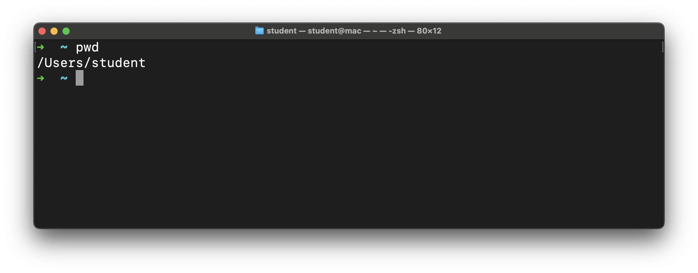
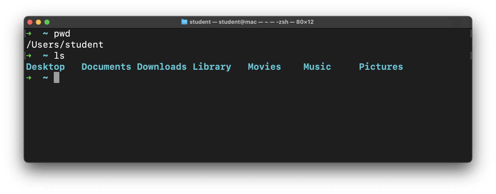
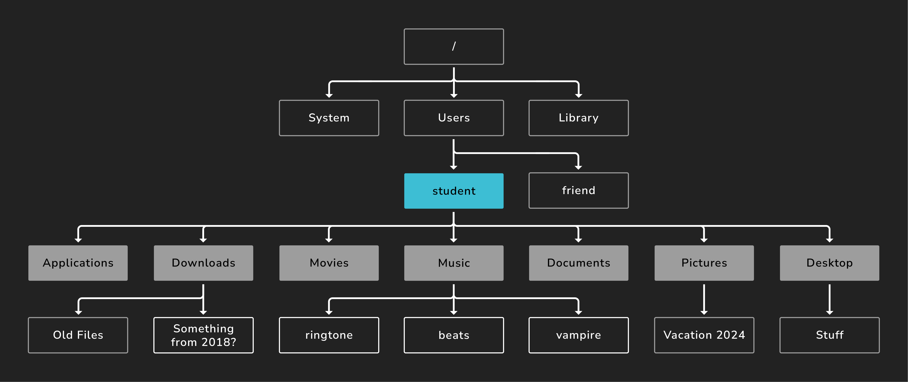
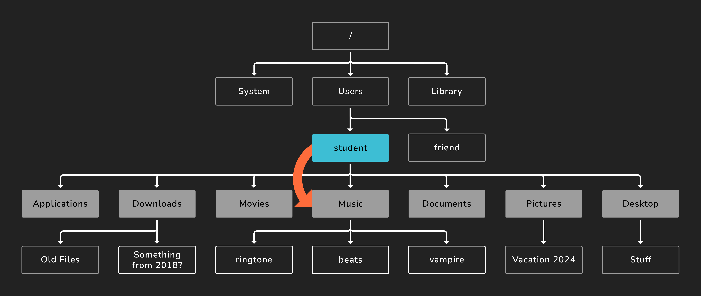
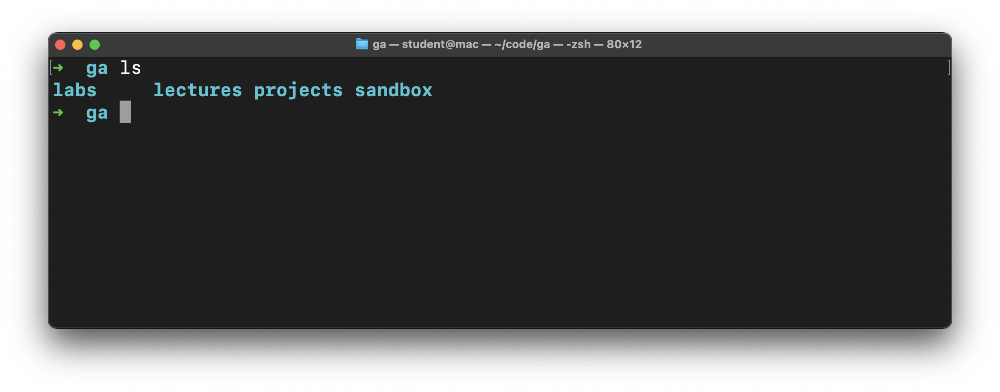

# Basic Commands

## Learning Objective

By the end of this lesson, you'll be able to:

* Practice using basic commands.

## The Basics

Here is a list commands we will learn:

- pwd
- ls
- cd
- mkdir
- touch
- rm
- rmdir

## `pwd`

The `pwd` command stands for “print working directory.” It’s the command equivalent to asking, “Where am I?”

The `~` we see in the prompt on the command line is shorthand for the current user's home directory. This command will confirm that. Write and execute this command now:

```bash
pwd
```



The screenshot above shows the path to the directory we're in right now (`/Users/student`). Your device likely shows something different, and that's expected. The home directory is where we start when we launch the terminal app.

Just like the Finder on a Mac, your CLI places you in a particular directory on your computer. pwd tells you where you’re currently located within your file system.

If we were using Finder in the GUI, we’d be able to see the files and directory that are present in this folder.

In a CLI, however, if we want to see the files and directory in our current location, we need to ask for that using another command.

## `ls`

Let's take a look around with the `ls` command. This command lists the contents of the directory we are currently in. In other words:

- The directories inside this directory
- The files inside this directory

```bash
ls
```

Ta-da! We’re speaking in a language our computer understands. This command lists the directory’s contents, something similar to:



The output of this command may be different for you, but that's okay! If you're on Windows and just installed WSL, you may not see anything here; that's also okay and expected!

 The visual below might help demonstrate what's happening here. The `student` directory (the current working directory) has been highlighted in blue. From this directory, the `ls` command will display its direct children, shown in dark gray. The other files and directories still exist. They aren't shown by this command though.



### A Caveat

This wouldn’t be an authentic language-learning experience if there weren’t a few caveats.

Operating systems and installed applications require lots of **hidden** files that aren’t always relevant to everyday users. But there will be cases where, as a programmer, you’ll want to view them.

We can do this with something called a **flag**, which is an additional command argument that modifies the behavior of the base command.

Flags start with the `-` prefix.

Type `ls -a`, which is the list command followed by the `-a` flag.

This means, **“Show me all of the files in my working directory and do not ignore entries that start with a period.”**

Your output may look different but should show previously hidden files.

## `cd`

To change directories, we’ll use cd — “change directory” — plus the name of the directory to which we want to change. Simple enough!

We just ran the `ls` command that gave us a list of valid destinations, including the `Music` directory. You might not have this directory. If not, pick another one.

Let's write and execute a command to change to that directory.

```bash
cd Music
```

In this line, `cd` is the command, and `Music` is the *command argument*. Notice the space between them.

`Music` is also a *relative path*. A *relative path* is the path from the perspective of the current directory. We'll use relative paths more often than absolute paths.



You could supply an absolute path as the argument if you wanted.

> 📚 A *relative path* is the path to a directory or file from the perspective of the current working directory. This contrasts from an *absolute path* which is written from the perspective of the *root* or `/` directory.

If we rerun `pwd`, we'll see that we're now in `/Users/student/Music` (or something similar).

> 🧠 Instead of typing `pwd` in the command line, you can find it from the previous commands you have run by hitting the up arrow on your keyboard. This cycles through all the previous commands you have executed.

Let's go back to the user home directory. We have a couple of options available to do this. Choose only one to write and execute.

- We could return directly to the user home using the `~` shortcut. Here's that command:

  ```bash
  cd ~
  ```

- We can also use `..`, which represents the parent directory of the current directory. This method works because the `Music` directory is the child of the user home directory. Here's the command to do this:

  ```bash
  cd ..
  ```

In this situation, these commands have the same result - changing the current working directory to the user home directory.

## Creating Directories

Let's create a directory! We'll get some additional practice navigating the file system too.

### `mkdir`

The `mkdir` command is used to create directories. The `mkdir` command takes a command argument like the `cd` command did.

Ensure your prompt indicates that you're in the `~` directory. If you're not, run:

```bash
cd ~
```

Once you're there, let's try out the `mkdir` command:

```bash
mkdir ga
```

Running this command will create a `ga` directory! Let's move into that directory with the `cd` command.

This time, only type `cd g` into the command line, then hit the `Tab` key. This should autocomplete the rest of the line, and it should now say `cd ga`. Execute that command!

This is called tab completion, and it is the best.

> ♻ **Repeatable pattern:** Tab completion will let you do less typing and save time. It's also more precise than manually typing paths out because it will only complete valid commands and paths. It's also a great tool in VS Code when we start using it.

### 🎓 You Do

Create another directory of your choice and move into it.

## Creating Files

Let's create a file!

### `touch`

You should be in the directory that you just created.

The `touch` command works very similarly to the `mkdir` command, except instead of creating an empty directory, it creates an empty file. Files typically have a file extension like `.html` for HTML files or `.png` for PNG image files.

```bash
touch file.txt
```

The command creates a file with the `.txt` extension, representing a text file.

## Deleting

We may have created more than we need; let's clean up some.

### 🎓 You Do

Delete the file and the directory that you just created.

- Use the `rm` command to delete the `file.txt` file. The syntax for the `rm` command is similar to the `touch` command, but it destroys instead of creates. **There is no trash to recover files from after they are deleted with this command, so use it carefully.**
- Navigate out of the current **directory** so you can delete it. Maybe return to the parent directory like we did earlier?
- Use the `rmdir` command to delete the directory you created in the **You Do** section earlier. This command works similarly to the `mkdir` command but will destroy instead of create like the `rm` command. This command will only delete empty directories.

After you've accomplished those tasks, create a directory structure that could be used if you sign up for a cohort.

In your `code` directory, create a `ga` directory to hold everything you do at General Assembly. Inside of this `ga` directory, make four more directories:

- `labs` - For all lab assignments.
- `lectures` - For all class lectures.
- `projects` - For any large projects done in a course.
- `sandbox` - For quick experimentation.

When you're done, you should be able to run the `ls` command in the `ga` directory and see the following:

