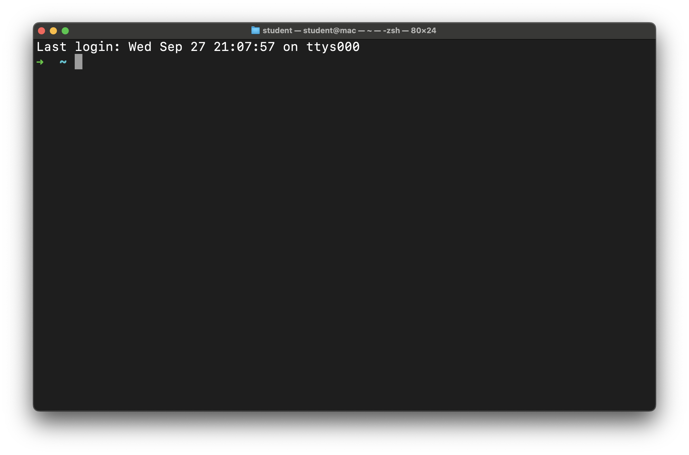
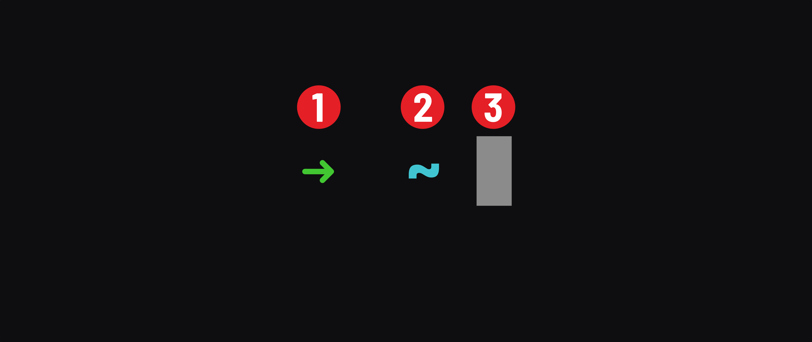

## Open the terminal application

How you open your terminal application will depend upon your OS.

### macOS

In macOS, use Spotlight to search for and open Terminal. Press `⌘ Command` + `Space` to open Spotlight and search for `Terminal`. Press `Enter` to open it.

### Windows

Use your system search to launch the Windows Terminal application in Windows 10 or the Terminal application in Windows 11. Despite the difference in names, a search for `Terminal` should work on either OS.

### Ubuntu

Ubuntu is cool and has a built-in keyboard shortcut to launch the Terminal application: `Ctrl` + `Alt` + `T`.

You can search for `Terminal` on your system and launch the Terminal app that way.

A quick note on the Ubuntu Terminal - copying and pasting uses a different keyboard combination in the terminal.

To copy from the Ubuntu terminal, use `Ctrl` + `Shift` + `C`. To paste text in the Ubuntu terminal, use `Ctrl` + `Shift` + `V`.

## The terminal interface

Regardless of your operating system, when your terminal application launches, you should see a window similar to the following:

Note that this terminal is running Oh My Zsh. If you have not installed Oh My Zsh, it will look different. The concepts and commands discussed in this lecture will be identical, even if you have not installed Oh My Zsh.

Here, you'll see the *prompt*. Let's dissect it:

1. The arrow `➜` indicates that the computer is ready to receive input. We can type commands on this line, and they can be executed.
2. The tilde `~` indicates our current location in the file system. We'll cover this more soon.
3. The cursor `█`. When you start typing, this is where the text will appear and is how we write commands to be executed.

> 📚 The *prompt* is a sequence of characters used in a command-line interface to indicate readiness to accept commands.

## Home Directory

In programming speak, all folders are called **directories**. A directory within another directory is called a **subdirectory**. A directory that contains a subdirectory is called a **parent directory**.

By default, our terminal starts in what is referred to as the **home** directory.

* For Mac, it is `/Users/yourname/`.
* For Windows, it is `c:\users\yourname`.
* For Linux, it is `/home/yourname`.

Mac users:

Windows users:

