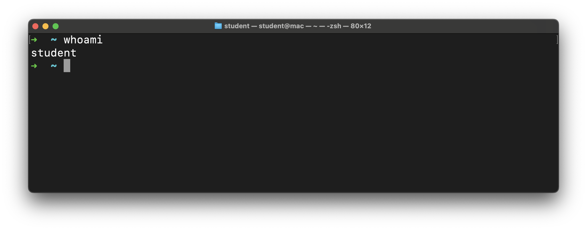
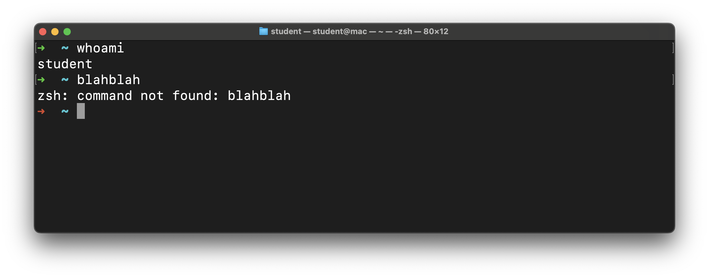

### Time

TBD

## Learning Objective

By the end of this lesson, you'll be able to:

* Write your first command and see your first error.

## Your first command

Since the computer is ready to receive input, let's type in a command:

```bash
whoami
```

Notice that we have control over when this command is executed. If you make a typo, there's still time to go back and fix it. Use your keyboard's arrow keys for this though; clicking with the mouse doesn't work here!

No typos? All ready to run this? Hit `Enter`!



This command has a simple job - print the username of the user that runs this command. In the screenshot above, the username is `student`. Yours will likely be different!

After that command finished executing, we were greeted by the prompt once again, and we're free to type more commands!

Let's try an invalid command, just to see what happens:

```bash
blahblah
```

Again, after you've typed this in, hit `Enter` to execute it.



Our first error! And it's pretty self-explanatory - `zsh: command not found: blahblah`.

We purposefully ran a command we knew was invalid, so it makes sense that it wasn't found. When you see this error, you're trying to run an invalid command!

> 🧠 Notice that the arrow `➜` at the start of the line after we received our error is red. All that this means is that the last command we ran failed in some way; we can still write and execute commands on this line.
