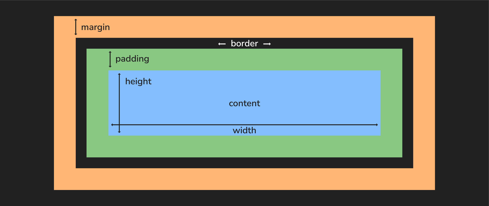
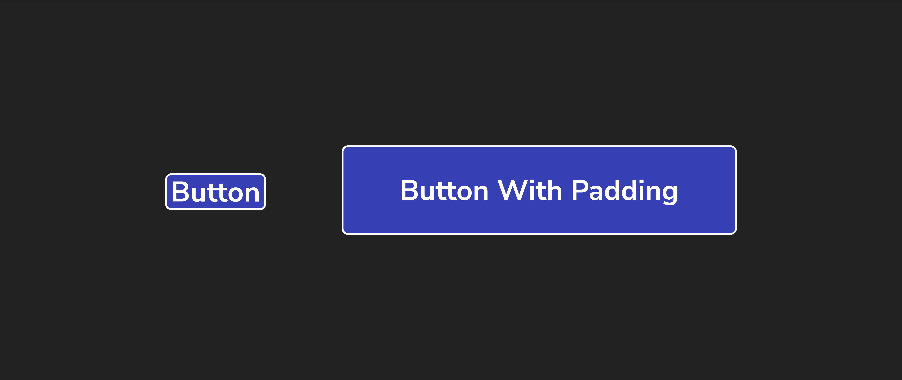

# The CSS Box Model

## Everything is a Box

Remember how we mentioned that block elements can have `margin`, `padding`, `width`, and `height` properties?

These properties comprise what we call the CSS “box model.” Think of any HTML element as having a “box” that wraps around its content and determines its total height and width.

Here’s what’s in that box:
* The **content** within the box, or whatever you added in the HTML.
* The **padding**, or the space that wraps around the content and pushes the borders of the box away.
* The **border** around the content and padding (which can be styled).
* The **margin**, or the space around the border that pushes the element away from other elements on the page.



Although other CSS units can be used, we'll typically measure these boxes in pixels, abbreviated in code as `px`.

### Content

The content of the box, where text and images appear.

### Padding

[Padding](https://developer.mozilla.org/en-US/docs/Web/CSS/padding) is the space between the content of an element and its border.

Padding can be added to any side of an element, and it can be different thicknesses on different sides. Padding is useful for creating space between the content of an element and its border or margin.



Adjusting the padding will shift the box's content but will not impact neighboring elements.

When we use a single value, it gets applied to all four sides:

```css
p {
  /* all four sides */
  padding: 2px;
}
```

You can also target a specific side of a box's padding like this:

```css
p {
  padding-bottom: 1px;
  padding-left: 2px;
  padding-right: 3px;
  padding-top: 4px;
}
```

You can also target different sides by using shorthand properties. The `border` property below previews this concept as well.

### Border

A [border](https://developer.mozilla.org/en-US/docs/Web/CSS/border) is the area (typically a line) surrounding the padding. Borders are useful for separating elements from each other and adding visual interest to a web page.

We can set the value of the border's width, style, and color all in one line using the `border` shorthand property:

```css
p {
  border: 3px solid red;
}
```

Or, if we wanted, we could break this into three lines:

```css
p {
  border-width: 3px;
  border-style: solid;
  border-color: red;
}
```

We can even control individual sides with properties that target them, like `border-bottom-width` and `border-bottom-style`, though this is less common.

### Margin

[Margin](https://developer.mozilla.org/en-US/docs/Web/CSS/margin) is the space between the border and other elements.

Margins can be added to any side of an element, and they can be different thicknesses on different sides. Margins help create space between elements and control a web page's layout.

We can manipulate the value of the margin property the same way as the padding property:

```css
p {
  /* all four sides */
  margin: 2px;
}
```

`margin-top`, `margin-right`, and so on are also available.

## Box Model Example

Check out the following code snippet and how it renders.

See how there’s some space around the text before the blue border? That’s the **padding** pushing the edge of the box away from the content. And see how there’s space between the box and the other text elements on the page? That’s the **margin** pushing other content away from the element.

Margin and padding help us space out elements on the page and organize how they appear:


## Specific Margins and Padding</h1>

So far, we’ve been adding margins and padding to all sides of an HTML element. However, you can also specify the sides of the box you want to adjust — maybe you only want to add padding to the top, or add more to the left than the right.

To do so, you’d write the CSS like so:
```css
div {
 padding: 10px 0px 5px 15px;
}
```

This means that the top of the `<div>` gets 10px of `padding`, the right side gets none, the bottom gets 5px, and the left side gets 15px. The acronym **TR**ou**BL**e can help you remember this order!


## Adjusting Width and Height

The `width` and `height` properties control — you guessed it — an element’s width and height.
