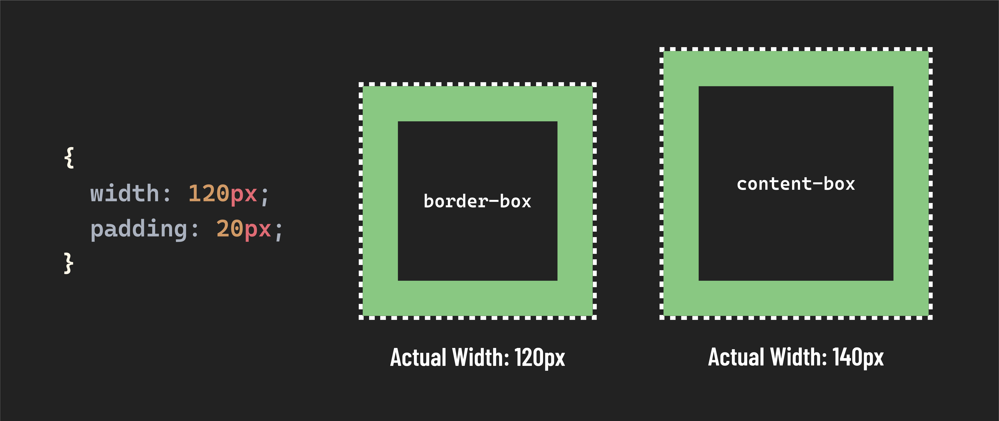

## What is `box-sizing`

`box-sizing` is a CSS property that allows us to control how the width and height of an element are calculated.

By default, when we specify the height and width of an element we are only setting the height and width of its content. However, when using the `border-box` value on the`box-sizing` property, any padding or border of the element is included in the calculation. Note, any margin is *not* included in `border-box`.



Typically, we want to apply this setting to every element on the page, so we use the `*` selector to apply this style universally.

```css
* {
  box-sizing: border-box;
}
```

This is a fantastic rule to apply at the top of your stylesheets, and is commonly used in CSS resets (we'll cover this more in the CSS Boilerplate lesson). Let's dive into why!

## Why use `box-sizing: border-box`?

Most importantly, this rule makes sizing elements more intuitive - when setting the height or width of an element, that is the exact height or width that element will be. This makes writing CSS much more predictable.

Because we've applied `box-sizing: border-box` universally, we can be sure that the height and width of any element on our page will always be calculated the same way.