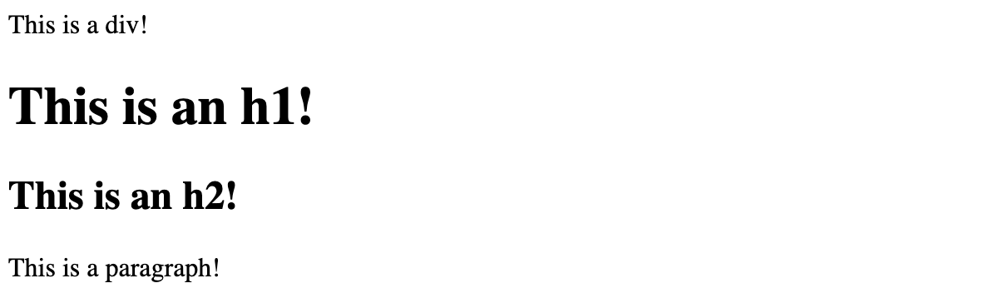

## Inline vs. block elements

Most elements are defined as either *block* or *inline* elements.

- Block elements display on their own line and take up the full width available to them.
- Inline elements are normally displayed without line breaks and occupy only enough space to contain their contents.

### Block elements

Examples of block elements include `<div>`, `<h1>`, and `<p>` elements.

The way we write code does not have any impact on how these appear in the browser. Here, on line 1, the `<div>` and `<h1>` are coded adjacent to one another. The same for the `<h2>` and `<p>` on the next line:

```html
<div>This is a div!</div><h1>This is an h1!</h1>
<h2>This is an h2!</h2><p>This is a paragraph</p>
```

Because they are block elements, they will render on their own line, taking up the full width available to them in the browser, as seen below:



### Inline elements

Examples of inline elements include the `<span>`, `<td>`, ``, and `<button>` elements.

Notice how, on line 1, the `<span>` and `<button>` are coded adjacent to one another, just as the elements above were:

```html
<span>I'm a span!</span><button>I'm a button!</button>
```

The difference is because they are inline elements, they will share the line and do not take up the full width of the browser:


> 💡 Block elements will not share the line they occupy; inline elements will!
>
> Block elements can be styled to become inline elements. Conversely, inline elements can be styled to become block elements.

How we wrote the code for these doesn't matter. What matters is the built-in behavior of these different elements.

> 🧠 Inline elements generally cannot have their height and width set in CSS. However, using CSS like this, `display: inline-block;`, allows inline elements to be sized.
>
> Some inline elements (for example, the ``) are [replaced inline elements](https://developer.mozilla.org/en-US/docs/Web/CSS/Replaced_element) and can be given width and height without changing them into inline-block elements.
