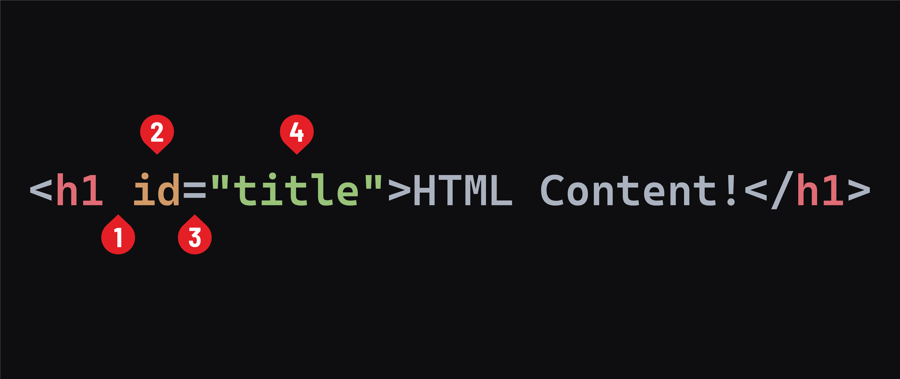

## Attributes

Elements have attributes that contain details about the element.

The available attributes will vary from element to element. However, many attributes work across every element, like the `id` attribute. The `id` attribute is used to uniquely identify an HTML element when necessary. It can also be used to help style elements. Here's the syntax to apply an `id` to our existing `<h1>` element.



1. A space between the element name and the attribute name.
2. The attribute name.
3. An equal sign.
4. An attribute value wrapped in opening and closing quotes.

A few additional notes about attributes:

- Working with attributes will only ever alter the first tag or the only tag in the case of a void element.
- Attribute names are always written in `lower-kebab-case`. In this convention, each word is written in lowercase and separated by a dash `-`.
- Multiple attributes can be used on a single element. A space should separate attributes.
- By convention, spaces aren't used to separate the equal sign from the attribute name or value, even though it would still be valid. The convention exists because spaces are the only thing separating different attributes. Adding extra spaces can make your HTML less readable.
- Double quotes are often used around the attribute value in HTML, but single quotes are also valid.

Attributes add a layer of powerful complexity to our HTML. MDN maintains a [list of attributes here](https://developer.mozilla.org/en-US/docs/Web/HTML/Attributes).

## Element and attribute indentation

At times, attribute values could be lengthy, or you may have many of them. To make your code easier to read, you should split the opening tag as in the examples below. You don't need to write this code or pay attention to these attributes. Just observe how indentation and line breaks are handled:

```html
<div
  class="my-class"
  id="my-id"
  draggable="false"
  hidden="false"
>
  My Content
</div>
```

```html

```

In the course content, we will indent elements and tags in this way when an individual line of code is over 80 characters in length.
