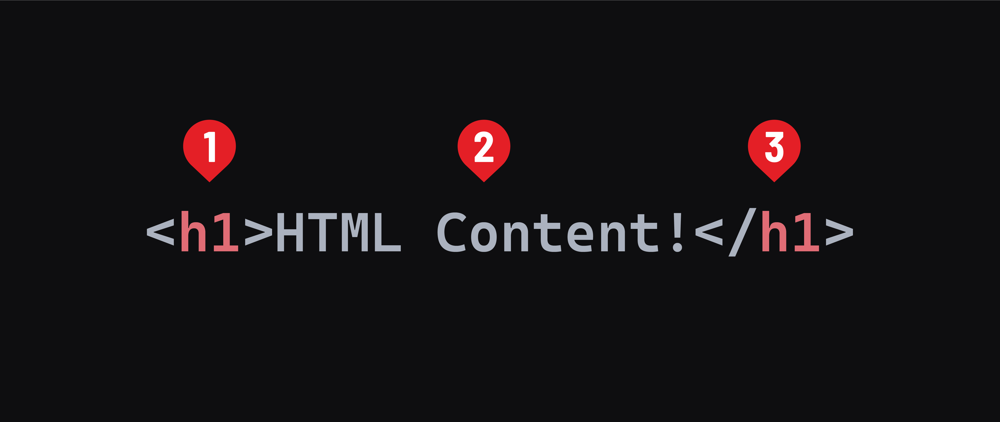

## Review - Element syntax

We'll talk more about the HTML boilerplate you created soon; for now add everything between the `<body>` and `</body>`. Content here will show up in the browser!

HTML documents are made up of elements.

At their simplest, elements are a pair of tags with content between them.



1. The opening tag. The tag itself starts with a `<` and ends with a `>`. Tags must also include the element name, like `h1` above. This indicates the start of an element.
2. The content of an element, `HTML Content!` here.
3. The closing tag. The tag starts with a `</` (note the addition of the slash) and ends with a `>`. The closing tag also includes the element name between. It matches the element name of the opening tag.

These things combined create an element.

Most elements have a semantic meaning (more on that later), and some default styling implemented by the browser. For example, an `<h1>` element indicates the main topic of a webpage. Along with this, its text content is bold, and its default font size is larger than any other text element.

Element names are always lowercase.

### Void elements

Some elements won't ever have text content. These are called void elements. Because they will not have text content, they do not have a closing tag. One such element is the `<hr>` element, which creates a horizontal rule.

```html
<hr>
```

You may see void elements written with a space and closing `/` added to the end of the tag. This is valid but not required.

```html
<hr />
```

## HTML Tags Galore

There are dozens of HTML elements, each with their own unique purpose. Here are just a few of the tags we use to define them:

| Tag | What It Does |
| --- | ------------ |
| `<h1-6>` | Creates heading text, with `<h1>` being the largest and `<h6>` the smallest. |
| `<p>` | Creates a paragraph of text. |
| `<ul>` | Begins an “unordered list” (e.g., bullets). |
| `<li>` | Indicates each list item inside of a `<ul>`. |
| `<a>` | Opens a hyperlink. |
| `<div>` | Defines a new section on the page. |
| `` | Adds an image. |
| `<br />` | Creates a line break. |

You might be wondering how you’ll ever remember all of those tags. Not to worry, you don’t have to!

You’ll learn some tags from frequent use; others you’ll never touch. And still others you can simply look up as needed. Tons of websites publish lists of HTML tags for easy reference. We recommend bookmarking [this handy one](https://www.w3schools.com/tags/).

And remember, even experienced web designers sometimes have to look up tags while coding!