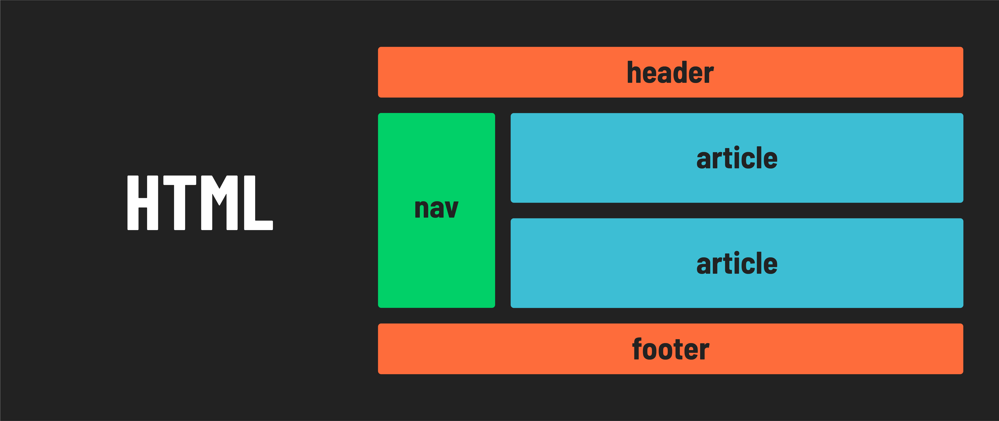

# HTML Tags Galore

HTML offers a vast array of elements, each designed for a specific purpose. Given that HTML lays the foundation for a webpage's structure, how can developers effectively communicate their intent and the page's organizational logic? This is where semantic tags come into play. These tags not only clarify the structure but also convey the meaning and purpose of the content, making it easier for both developers and browsers to understand the layout and function of the webpage.

## Semantic HTML

Semantic HTML helps express the meaning or purpose of the content in a webpage:

It also improves accessibility for the visually impaired enabling screen readers to do their job better.

It also allows for more accurate web searches via better SEO (*search engine optimization*).

> 📚 The goals of *search engine optimization* are to increase the quantity and quality of traffic to a website through search engine results. It involves making changes (including using semantic HTML) to a website to make it more attractive to search engines.

## 🎓 You Do

Take some time to research these semantic HTML tags. Research how these tags differ from the non-descriptive `
` element.

Semantic Tags for Structure:

1. `<header>`
2. `<nav>`
3. `<main>`
4. `<article>`
5. `<section>`
6. `<aside>`
7. `<footer>`

Non-Semantic Tags for Text:

1. `<h2> to <h6>`
2. `
`
3. `<a>`
4. `<ol>`
5. `<ul>`
6. `<em>`
7. `<strong>`
8. `<code>`

## Tips

You might be wondering how you'll manage to remember all those HTML tags. Not to worry—you don't have to memorize them all!

Many tags will become familiar through frequent use, while others might never be needed. For those you don't remember, you can easily look them up. We recommend bookmarking [this handy reference](https://www.w3schools.com/html/html5_semantic_elements.asp) from W3Schools for quick access.

Keep in mind, as a best practice, you should avoid using semantic HTML tags solely for styling purposes. While web browsers do apply default styling to many semantic tags, this doesn't mean that HTML tags should be used to style your text. For instance, it's not advisable to use `<h1> to <h6>` tags for text that isn't acting as a heading simply to change its font size. For styling purposes, always use CSS.

And remember, even seasoned web designers often refer to tag references while coding!