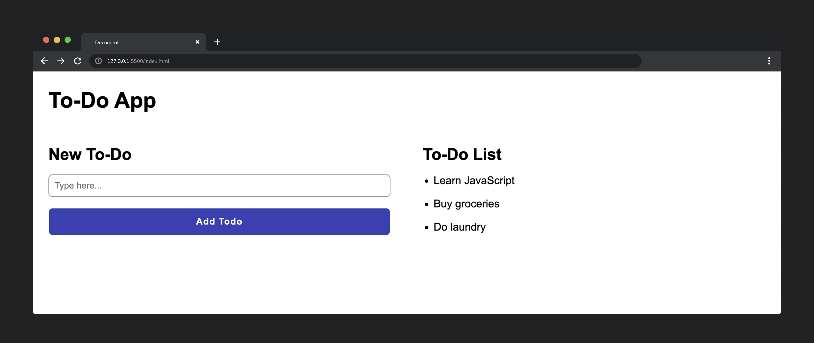
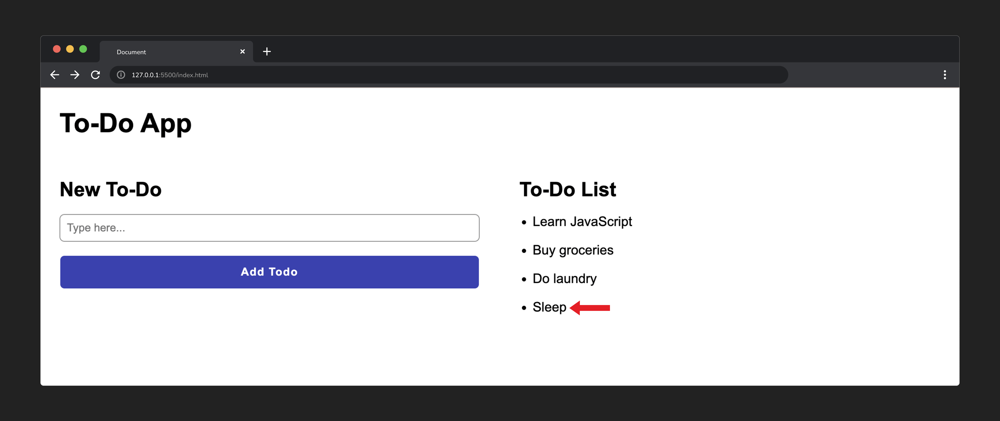

## What are DOM events?

Imagine DOM events as triggers on a web page. They are like signals that tell the web page when something has occurred, and then the web page can respond to that signal automatically.

In other words, DOM events are like the building blocks that make web pages interactive.

## Why do we use DOM events?

Programmers use DOM events to create interactive web pages. It's like giving the web page the ability to listen and respond to what users do. When you click a button or type something, the web page can react, making it dynamic and engaging.

This allows us to implement *event-driven programming*. In event-driven programming, the majority of the code reacts to events triggered by users. This is made possible by using JavaScript to manipulate the DOM.

For example, imagine a user is interacting with a small to-do application that looks like this:

To interact with this app, the user might want to:

- Type the name of a new to-do item into an `<input>`
- Click the `<button>` labeled **Add to-do**

What happens when the user clicks the button? This is where events come into play. For the app to function as the user expects, the click would trigger a function that performs a series of tasks:

  1. Capture text entered into the `<input>` element.
  2. Create a new list item element
  3. Set the content of the new list item element to the text entered by the user
  4. Place the new list item into the list
  5. Finally, for a better user experience, clear the input so its ready for the next item

All of these steps require JavaScript to perform the interactions with html elements on the screen.

## Types of events

Lots of events can be generated within the browser. For example, all of these actions can trigger an event:

- A user moves or clicks the mouse.
- A user presses a key.
- A form is submitted.
- The page has finished loading or has been resized.
- And more!

Take a quick peek at the [MDN documentation for events](https://developer.mozilla.org/en-US/docs/Web/Events) to see the sheer number of events we can respond to.
