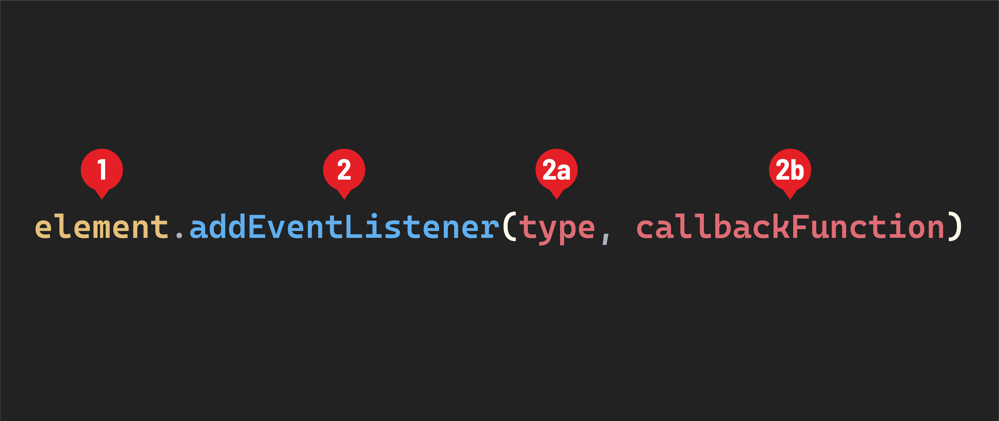

## Listening to events

In JavaScript we use the [`addEventListener()`](https://developer.mozilla.org/en-US/docs/Web/API/EventTarget/addEventListener) method to attach *event listeners* to HTML elements in the DOM.

> 📚 An ***event listener*** is a function or piece of code in JavaScript that "listens" for specific events to occur on an HTML element, such as a click, mouseover, or keypress event. When the specified event happens, the event listener executes its associated code, allowing you to respond to user interactions and perform actions on your web page.

 Here is the common syntax for doing this:



1. The element we want to add an event to.
2. The `addEventListener()` method. It accepts two arguments:

    2a. The `type`. This should be a string and indicates the event that the event listener will respond to.

    2b. The `callbackFunction`. The `callbackFunction` is a function that will be executed when the event `type` we've specified happens on the `element` that is *listening* for it.

> A callback function is a function passed into another function as an argument.

The `callbackFunction` above operates in a very similar way, but the code inside of it will be executed in response to an event triggered buy a user interaction.

> ♻️ Repeatable Pattern: When working directly with the DOM, we always use the `addEventListener()` method to attach event listeners to elements.

## The `'click'` event

Let's build an event listener that will respond to one of the most common types of events - the `'click'` event. We'll add this to the `<button id="like-button">` element we created during setup.

An element receives a [`'click'` event](https://developer.mozilla.org/en-US/docs/Web/API/Element/click_event) when a mouse's primary button is pressed and released on that item. Other pointing devices can also trigger a `'click'` event, such as a finger tapping an element on a mobile device's touch screen. For this lesson, let's assume we are working with mouse clicks.

Let's start by selecting the `<button id="like-button">` element from the DOM and create a variable called `likeButtonElement` to keep track of it.

```javascript
const likeButtonElement = document.querySelector('#like-button');

// let's log it to confirm
console.dir(likeButtonElement);
```

After you've confirmed that you've selected the `<button id="like-button">` element from the DOM, you can remove the `console.dir()`.

Now, let's attach our first event listener to that element:

1. To listen for a click event, we'll use the `addEventListener()` method and pass the string `'click'` as the `type`.
2. Then we'll write the callback function so that it logs the string `'You clicked me!'`

```javascript
likeButtonElement.addEventListener('click', function() {
  console.log('You clicked me!');
});
```

Return to your browser and open your DevTools. Click on the `button` element in the browser. You should see a message logged to the console: `'You clicked me!'` - congrats! You've built your first event listener!
