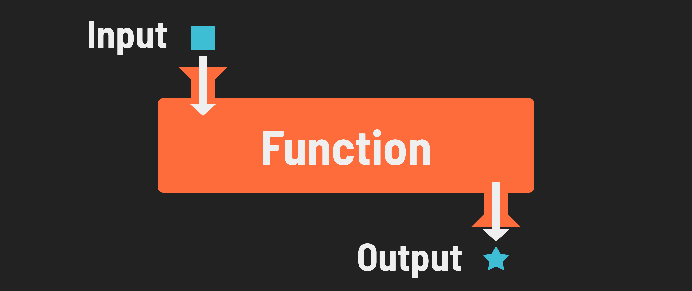

## Introduction to Functions
Ask a roomful of programmers about their pet peeves, and nine out of 10 will tell you it’s having to repeat their code. Luckily we have functions, or blocks of code you can run on command to perform a specific routine. Just call the function’s name and it comes running. In this lesson, we’ll learn how to wrap our reusable code into functions.

## A Digital Machine

In both mathematics and programming, a function represents a way to encapsulate operations so they can be reused with different inputs. Imagine you have a small machine that takes in a number, adds two to it, and then gives the result back to you. In mathematics, you might describe this operation with a function like f(x) = x + 2. This notation means that for any input (x), the function (f) will output the value of (x) plus two.

For example, if you substitute (2) for (x), the function becomes f(2) = 2 + 2, which simplifies to f(2) = 4. So, when you input (2), the output is (4).

Translating this concept into JavaScript, we can write a function to do the same thing:

```js
function addTwo(x) {
  return x + 2;
}
```

## What is a function? 

A *function* is a reusable block of code written to perform a single purpose. With a function, you can store code that can be used conveniently as many times as you wish without having to rewrite the code each time. As a result, functions are one of the fundamental building blocks of JavaScript, and you'll find and use them everywhere. 



Functions optionally take in data as input and return a single piece of data (including complex data such as objects or other functions).

> 📚 A *function* is a block of code that can be called as needed and is designed to perform a specific task. A function may accept input and can return a result after completing its task.

## Why are functions essential in programming?
### Tackle complexity

We typically tackle a complex task by breaking it into smaller tasks or steps - when we're programming, we want to do the same! Functions allow us to break up programs into more manageable blocks of code.

### Code reuse

Functions provide code reuse because they can be called repeatedly. For example, a `renderBoard` function might be called every time the data in a board variable is changed. This allows us to keep our code DRY.

### Documentation & debugging 

Naming functions appropriately, for example a name like `renderBoard` helps document what that function's job is (to show the user the current game board).Organizing code into functions also makes it easier to find and fix code that's not working as expected, a process known as debugging.

Now that we understand what a function is and why it's used, let's figure out how to propery write one.

## Not Like This...

Imagine you’re creating a battle game where a player can take damage from lots of sources — other players, monsters, machines, and more. To program the game, you’d have to write the exact same lines for every situation in which the player could get damaged:

```javascript
if (enemyAttack === true) {
   player.health -= 1;
   player.damageTaken += 1;
   player.points -= 100;
} else if (monsterAttack === true) {
   player.health -= 1;
   player.damageTaken += 1;
   player.points -= 100;
} else if (machineAttack === true) {
   player.health -= 1;
   player.damageTaken += 1;
   player.points -= 100;
}
```
...and so on.

If you decided that players should only lose 50 points when they take damage, you’d have to track down EVERY appearance of that line of code in the program, which might be in dozens or hundreds of places. This is a recipe for buggy code and long, hard-to-read programs. Time for functions to step in.

## ...Like This

We can bundle up those lines of code into a **function**:

```javascript
function takeDamage() {
    player.health -= 1;
    player.damageTaken += 1;
    player.points -= 100;
}
```

Later in our game program, we can use that function by invoking it with its name, `takeDamage()`. If we need to add more logic to this procedure, all we have to do is change this one block of code.

## The Need for DRY Code

Functions not only modularize our work, they also allow us to save time and effort when writing programs.

This is an important programming practice known as “**D**on’t **R**epeat **Y**ourself,” or DRY coding. When our code is DRY:
* It’s easier to maintain.
* It performs better.
* It’s more readable.
* It’s less buggy.

That’s basically everything you want your code to be. Sounds great, right?


## Defining a Function</h1>

Let’s take a look at a simple function to break down its parts:


* First, we have the `function` keyword, which lets JavaScript know we’re declaring a function.
* Then, we write the function’s name — in this case, `sayHello`. **A function’s name should always describe what the function does.**
* The parentheses are there to define parameters or any input the function requires. This function has no parameters, but we still put empty `()` after the function name.
* Then, we have the code block we want to execute surrounded by curly braces. This should seem familiar — it’s the same way we defined a code block for conditionals and loops. The idea is the same; we define what we want to happen under certain conditions (in this case, when the function is invoked).

## Invoking a Function

Once you’ve defined the function, getting it to execute is as easy as using the function’s name with parentheses included: `sayHello()`.

A common error for first-time programmers is forgetting to call the function after defining it.

This JavaScript won’t actually do anything:
```javascript
function sayHello() {
    console.log("Hello!");
}
```

But this code will, as we invoked the function by adding its name. (You might also hear this referred to as “calling” the function.)
```javascript
function sayHello() {
    console.log("Hello!");
}

sayHello();
```

## You Do!

Let’s practice by writing and invoking a function that logs the chorus of your favorite song.

* Name the function `sing`.
* Inside the function, use a `console.log()` with the lyrics of your choice.
* Once you’ve defined the function, bring it into action by invoking it one time.

