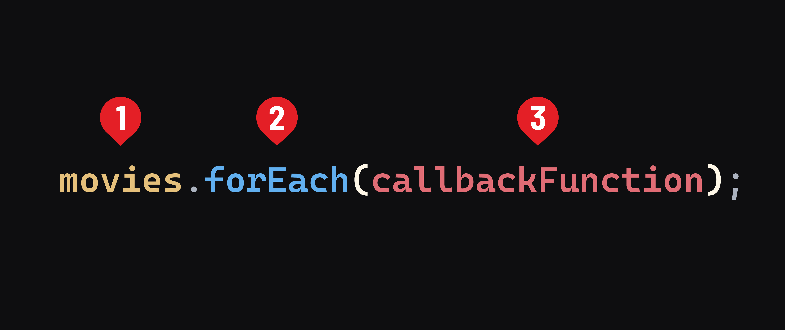

## Functions and Arrays

The last few concepts we’ve learned are especially powerful in combination with each other. Let’s try writing a function named `printArray()` with the following guidelines:

* `printArray()` accepts an array as a parameter, which you could name `arr`.
* `printArray()` uses a `for` loop to iterate over each element in order to log each element to the console.

**Learning objective:** By the end of this lesson, students will be able to utilize the `forEach()` method to execute a function on each item in an array.

## Introducing the `forEach()` iterator method

The [`forEach()`](https://developer.mozilla.org/en-US/docs/Web/JavaScript/Reference/Global_Objects/Array/forEach) method is another declarative approach that provides a more readable way to iterate over ***all*** array elements. This method clearly communicates a developer's intention to process each item and perform an action on each.

### Functions as arguments

Before we dive into `forEach()`, let's talk about a very cool feature of JavaScript. It treats functions as *first-class citizens*, meaning they operate like any other piece of data so they can be used as arguments.

> 📚 Entities such as functions in JavaScript that can be assigned to a variable, passed as an argument to a function, returned from a function, and stored in arrays or objects are known as *first-class citizens*.

### Anonymous functions

When functions are used this way, they also don't need a name. These unnamed functions are called *anonymous functions*. These look and behave like other functions; they just don't have a name. This is great for one-time tasks where we don't intend to call the function again.

> 📚 An *anonymous function* is a function without a name. Unlike named functions, you can't refer to anonymous functions later in your code, making them useful for one-time operations.

## Syntax

This is the most basic syntax for using the `forEach()` method on the `movies` array:



1) The array that we will iterate through, in this case, `movies`.
2) The `forEach()` method. This method always returns `undefined`, no matter what code is inside the callback function.
3) The *callback function* is where we will write the function that will be executed for each item in the `movies` array.

> 📚 A *callback function* is a function passed into another function as an argument. 

We'll start with the simplest callback function we can:

```js
// as a reminder, movies is ['Barbie', 'Arrival', 'Get Out', 'Coco']

movies.forEach(function(movie) {
  console.log(movie)
});
```

> 🏆 It's recommended to name the first parameter (representing each item) as a singular form of the array's name. So, if your array is named `movies`, name the parameter `movie`.

Remember this callback function runs for each item in the `movies` array. `movie` is an individual element in the `movies` array. So in the first iteration `movie` will be `'Barbie'`. In the second, it will be `'Arrival'`, and so on.

This code will result in the following output:

```text
Barbie
Arrival
Get Out
Coco
```

In addition to the current element, `forEach()` also provides the index of the current element to the callback function:

```js
movies.forEach((movie, index) => {
  if(index === 2) console.log("This is the third movie:");
  console.log(movie);
});
```

Which will result in the following output:

```
Barbie
Arrival
This is the third movie:
Get Out
Coco
```

> 🚀 Check out the [Expanding on `forEach()` Level Up](../level-up/expanding-on-forEach.md) for more examples of using this method.

## Conclusion

Functions are the key to creating re-usable, readable programs. Instead of a pile of lines of disorganized code, you end up with clearly named blocks that add up to bigger things.

You're now ready to start practicing JS with code challenges on sites like <a href="https://www.codewars.com/" target="_blank" rel="noreferrer noopener">Code Wars</a> or <a href="https://leetcode.com/" target="_blank" rel="noreferrer noopener">LeetCode</a>, which typically take the form of "Write a function that does _________."
