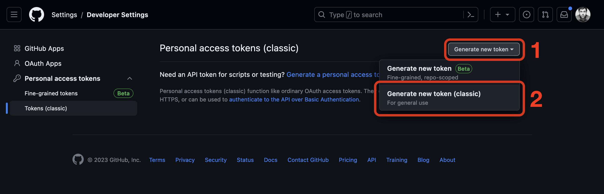
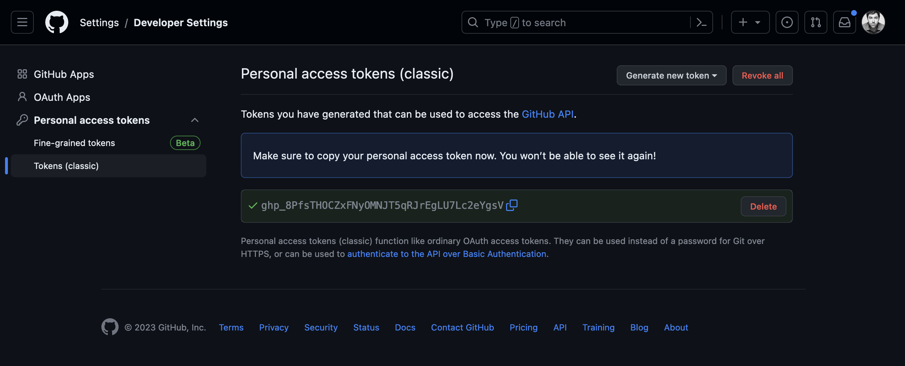

# 

GitHub deprecated the use of password authentication via the command line in 2021, as detailed in **[this GitHub blog post](https://github.blog/2020-12-15-token-authentication-requirements-for-git-operations/)**. This means we must authenticate using GitHub's preferred authentication method: personal access tokens.

To create a personal access token, visit **[`https://github.com`](https://github.com)** and ensure you are signed in. Also, ensure that you have **[verified your email address](https://docs.github.com/en/github/getting-started-with-github/verifying-your-email-address)** with GitHub. After doing so, navigate to **[`https://github.com/settings/tokens`](https://github.com/settings/tokens)**.

On the **Personal access tokens (classic)** page, click **Generate new token** and then **Generate new token (classic)** as shown below.

You will be taken to a page prompting you to create a **New personal access token (classic)**. Provide these details:

- Fill the **Note** field with a descriptive name of the device you are using the token with (we've used the name **2023 MacBook Pro** in the screenshot below, but you should use a name matching your own device).
- Change the default expiration date. If you set an expiration date, we recommend setting a custom expiration date for one year from today’s date (the maximum time allowed), but you may choose to set it to never expire.
- Select the **repo** and **user** scopes. You'll note that when you select these scopes, all of their sub-scopes are also selected - ensure your selections match what is in the screenshot below. When you have done so, click the **Generate token** button.

You will be taken back to the **Personal access tokens** page, and the token you just created will be visible:

Click the copy button to copy the newly created token.

You will only see the token on this page ***ONCE***. You ***MUST*** copy it now and paste it in a secure and private place where you can easily access it later when you need it. Treat this token as you would a password! The token will be used in place of a password to interact with GitHub on the command line!

Using multiple machines? It is best practice to create a new token for each device requiring command-line access to GitHub. This way, if you need to revoke access to any single device, none of your other devices are impacted.

***Place the token in a secure place! The next time you interact with GitHub on the command line, you will be asked to provide a username and password. Use this token in place of a password.***
