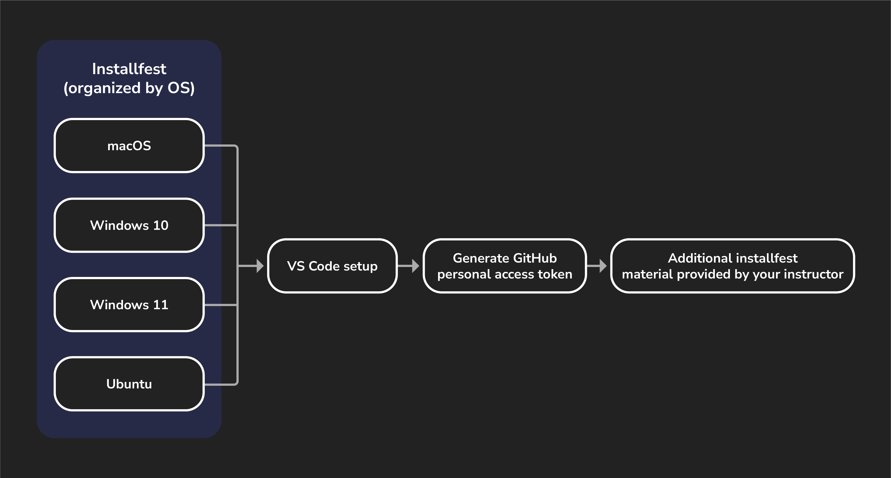

# 

Installfest can feel stressful at times. You're using applications you're possibly unfamiliar with, running a bunch of commands you don't recognize, and hearing terms and vocabulary for the first time. You may even see errors you don't know how to begin troubleshooting.

That's all ok though, because setting up and configuring your local development environment is your first real step in your career as a developer! As you're going through installfest and encountering unfamiliar technologies, don't be afraid to research these more and seek deeper understanding. And when you encounter errors, don't forget that your instructional team is here to help too!

To help you through this process, we've included this handy guide walking you through the individual steps so that you can at least be sure you're not missing anything along the way. Follow the process outlined below (and shown above) to guide you through this process.

## 1. Install software for your OS

Most installfest content is found within these OS-specific guides that will walk you through a setup process tailored to your OS. ***Make sure you only follow one path! Do not open the installfest documents for any OS other than the one you want to set up.***

- macOS
- Windows 10
- Windows 11
- Ubuntu

### What are we installing?

The installfest resources in this module will guide you through installing or configuring the following applications, **regardless of your operating system**:

- Zoom
- Zsh
- Oh My Zsh
- Visual Studio Code
- Git
- nvm
- Node.js
- nodemon

You'll also set up both GitHub and General Assembly GitHub Enterprise accounts.

### Some installfests include applications specific to one OS, noted below

#### macOS

- Rectangle
- Xcode command line developer tools
- Homebrew

#### Windows 10/Windows 11

- Windows Terminal
- WSL (Ubuntu)
- Visual Studio Code WSL Extension
- PowerToys (optional)

#### Ubuntu

- curl

## 2. Setup VS Code

Visual Studio Code (VS Code) is a free, open-source code editor developed by Microsoft that is compatible with Windows, macOS, and Linux.

Here are some of its best features:

- **Extensibility**: Rich marketplace for customizable extensions, supporting various languages and frameworks.
- **Built-in Productivity Tools**: Features like IntelliSense and integrated Git support streamline the development process.
- **Performance & Community**: Lightweight, fast, and backed by a strong community for quick issue resolution and support.

## 3. Generate a GitHub personal access token

Follow the steps in the **GitHub Personal Access Token walkthrough** so that you're able to interact with GitHub from the command line.

## 4. Additional installfest material provided by your instructor

If your instructor has any tools they would like you to install, you'll tackle those last. Those documents will be provided by them directly.

## 5. Celebrate, you're done! 🎉
