# 

WSL 2 is still under very active development. If you are uncomfortable with configuring and troubleshooting Windows and Linux, this may not be a good solution for you.

## What is it?

Never heard of WSL before? You're not alone, here's what Microsoft has to say about it:

> The Windows Subsystem for Linux lets developers run a GNU/Linux environment -- including most command-line tools, utilities, and applications -- directly on Windows, unmodified, without the overhead of a traditional virtual machine or dualboot setup.

That's fun, but what does that mean in practice? As a Windows user, you'll be able to run the same command line apps and use the same commands as your macOS and Ubuntu neighbors in the cohort.

## What you need to begin *(you must read this, do not skip this, this is important)*

- ***A device running Windows 10 version 22H2 (OS Build 19045 or greater).***

  To find your Windows version and build number, use **`Windows Logo Key` + `R`** on your keyboard, type **`winver`**, and select **OK**. You'll see a dialog window like the one below. Note the Version: 22H2.

  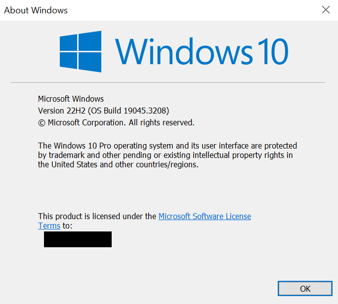
- Familiarity with your system's BIOS may be required. This is extremely important as you may need to adjust BIOS settings to complete the WSL install, particularly if your machine uses an AMD processor. You cannot screen share within the BIOS environment, and your BIOS environment will be unique to the device you use. Therefore, it is on you to enter this environment and find the settings you will need to change. ***Modifying the incorrect settings in the BIOS can cause permanent hardware damage to your device, which we are not liable for. If this scares you, WSL may not be your best option.***
- A non-Windows 10 S Version of Windows 10.
- A user account with administrative privilege to your local installation of Windows 10.
- A Microsoft Account with access to the Microsoft Store application. All requirements are free, but some are only available from the Microsoft Store.
- At least 20GB of free hard drive space.
- At least 8GB of RAM. 16GB of RAM or more is preferable and will improve your learning experience (particularly when screen sharing in Zoom).
- A modern processor capable of running virtual environments - specifically processors with Intel Virtualization Technology (Intel VT) or AMD Virtualization (AMD-V) technology.
- A fundamental understanding of Windows and Linux system administration and debugging.

## Troubleshooting

If you run into issues during installfest, please reach out to your installfest point of contact.

Remember, WSL 2 is under active development, with new issues being found regularly. There might not be fixes for some problems. We will make our best effort to assist you in debugging any problems, but occasionally, the solution to a problem may not exist.

## Zoom

We'll hold class in Zoom. If you haven't already, download the Zoom client from **[here](https://zoom.us/download#client_4meeting)** and install it.

## Install Windows Terminal from the Microsoft Store

Follow **[this link](ms-windows-store://pdp/?ProductId=9n0dx20hk701)** to launch the Microsoft Store application (you may be prompted to allow this) and be taken to the Windows Terminal store page. Note that if the Microsoft Store application doesn't launch when you click on the above link in your browser, you may need to manually launch the Microsoft Store application and find **Windows Terminal** in the store through a search.

When the app opens, select the **Install** button as highlighted below to install the Windows Terminal application.

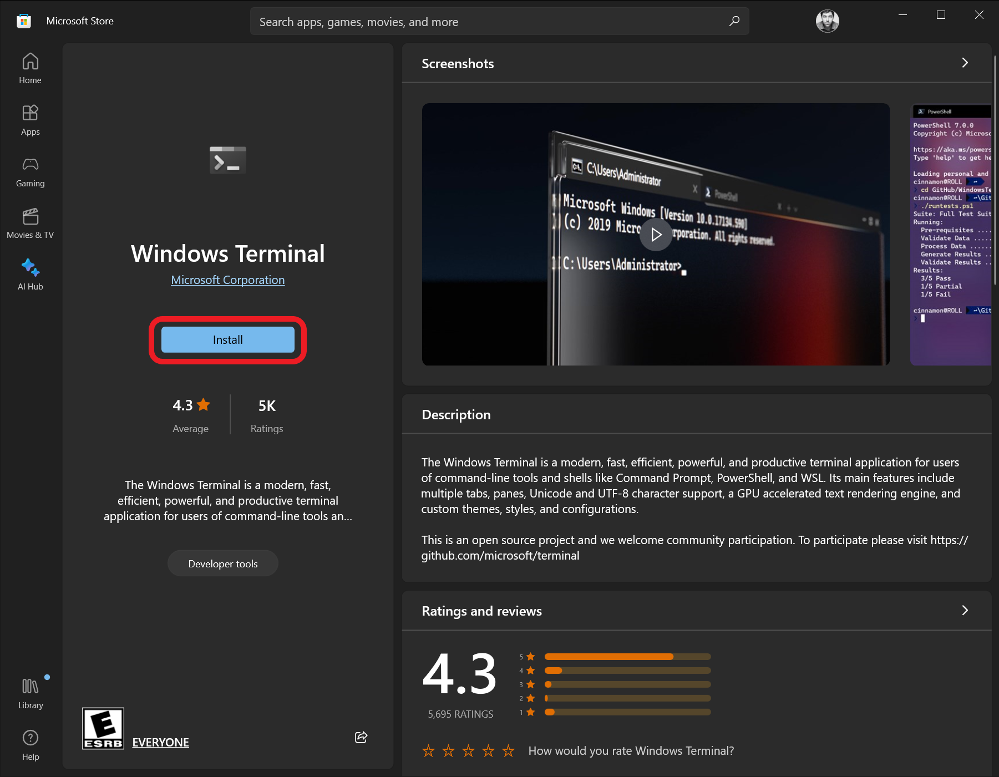

Windows Terminal will download and install. When this is complete, the application can be started by selecting the **Open** button.

When the Windows Terminal is launched, ***pin it to your taskbar*** by right-clicking the icon in the taskbar and selecting the **Pin to taskbar** option. This is how we will eventually launch Ubuntu.

Once the Windows Terminal is pinned to your taskbar, close the application. We need to launch it with administrative privileges to complete our next task.

Hold **`Ctrl + Shift`** and click the Windows Terminal icon in the taskbar to launch it with administrative access. You’ll be prompted to confirm this action - do so.

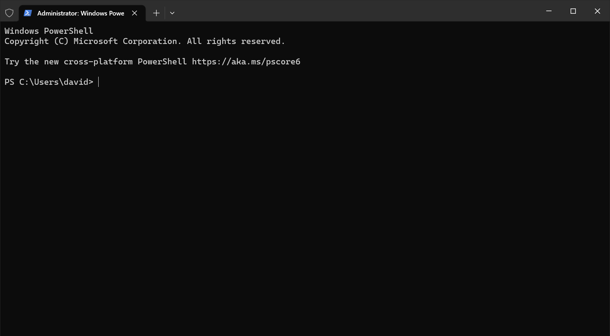

Note the shield in the title bar indicating that PowerShell is running with elevated permissions!

## A note on copying commands

When possible, ***please copy the commands from this page***. You will use most of the commands here once and never again. Typing them out will only introduce the possibility of you making errors. Certain commands will require you to alter portions of them - this is specifically called out when they appear. There are no bonus points for doing work already done for you.

### Copying text in code blocks

To copy text from code blocks, use your mouse to hover over the code block. A **Copy** button will appear in the upper right corner. Click this, and the text held in the code block will be put on your clipboard, ready to be pasted.


## Install WSL

Use this command to install Ubuntu in WSL2. You may be asked to allow apps to have administrative access throughout this process; do so when you're asked.

```powershell
wsl --install -d Ubuntu
```

To run a command, paste (or type) it into your terminal, confirm it matches what you intended, and press the **`Enter`** key.

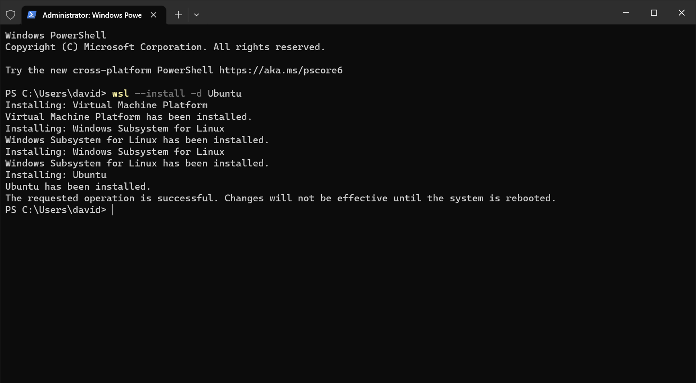

Above, you can see the expected output shown in PowerShell after running the install command.

## Restart your computer

Save any work you want to keep, including this page, and restart your computer to continue!

Upon restarting, the Ubuntu Installer will launch automatically (as shown below) and then finalize the installation, which may take a while. If you get an error message or run into another issue, check out the **Handling errors 💔** subsection below.

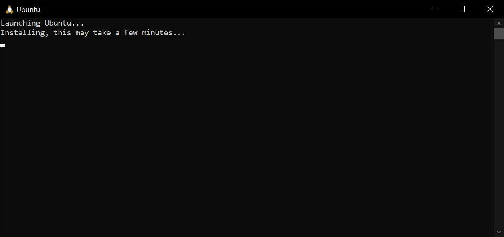

### Handling errors 💔

#### Virtual Machine error

You may see this message after your machine restarts:

```plaintext
Please enable the Virtual Machine Platform Windows feature and 
ensure virtualization is enabled in the BIOS.
```

Or this message:

```plaintext
The virtual machine could not be started because a required feature is not installed.
```

If either of these errors occurs, run the command below in PowerShell with Administrator permissions (reference the above instructions to launch PowerShell as the Administrator):

```powershell
dism.exe /online /enable-feature /featurename:VirtualMachinePlatform /all /norestart
```

and restart your machine.

***If the error persists after restarting, you likely need to enter your BIOS and enable Intel Virtualization Technology (Intel VT) or AMD Virtualization (AMD-V) technology to continue. This error is most common with AMD processors.***

#### The Ubuntu application does not start upon login

Launch the Ubuntu application with a search for **Ubuntu** in the Start menu.

#### I do not have any of the above errors

Reach out to your installfest point of contact for further guidance.

## Creating a user account

You will then be prompted to create a username and password. The username should not have any spaces in it. The username doesn’t need to match your Windows username, but it can if you would like. *The password will not be visible as you type it. This is common in many command-line applications.* It is ***vital*** that you do not forget this password, as you will use it throughout the course to interact with WSL.

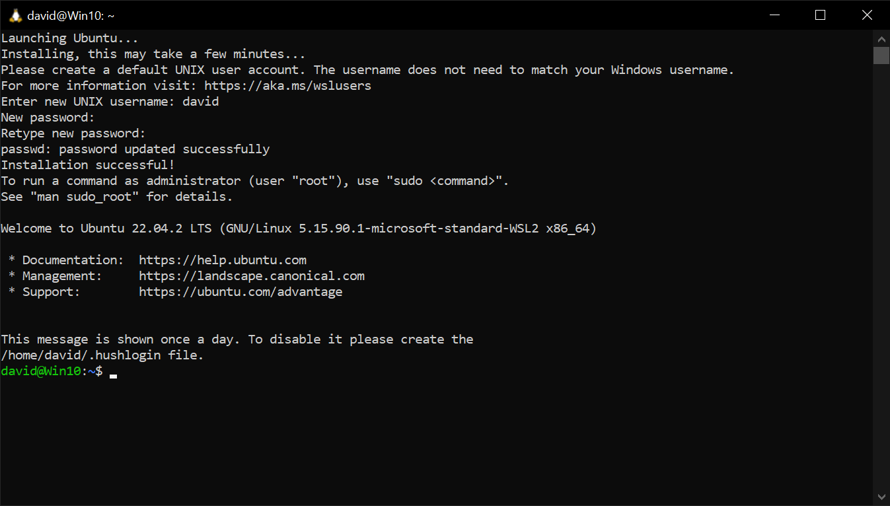

🎊 You're now running WSL 2! Congrats! Go ahead and close the Ubuntu application - we won't use it again. Don't close this guide though; you're not quite done yet.

## Launch the Windows Terminal

Launch the Windows Terminal application.

Windows Terminal will initially launch with only a Windows PowerShell tab. Let's configure it to launch into your Ubuntu installation by default. Select the dropdown arrow in the title bar, then select **Settings** to open the Windows Terminal settings.

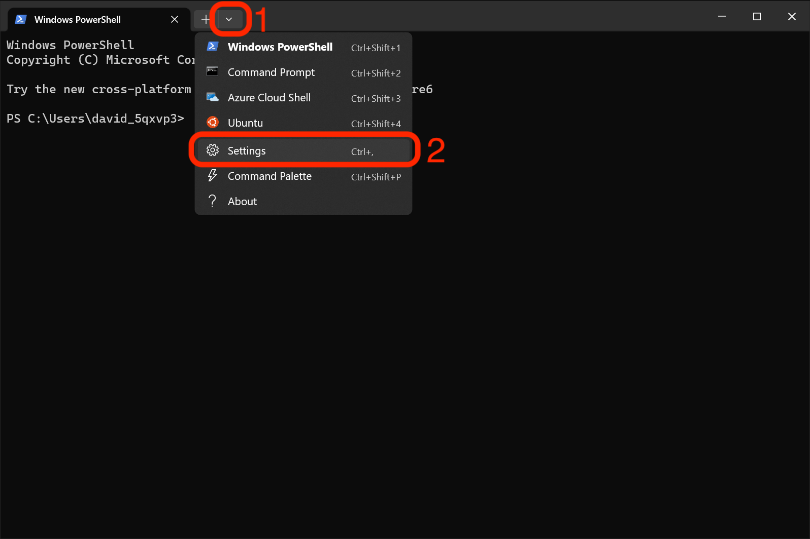

The **Settings** tab should open with the **Startup** section already selected. The first order of business is changing the **Default profile** setting in this section to **Ubuntu**. While we're here, change the **Default terminal application** to **Windows Terminal**. After making these modifications, click the **Save** button.

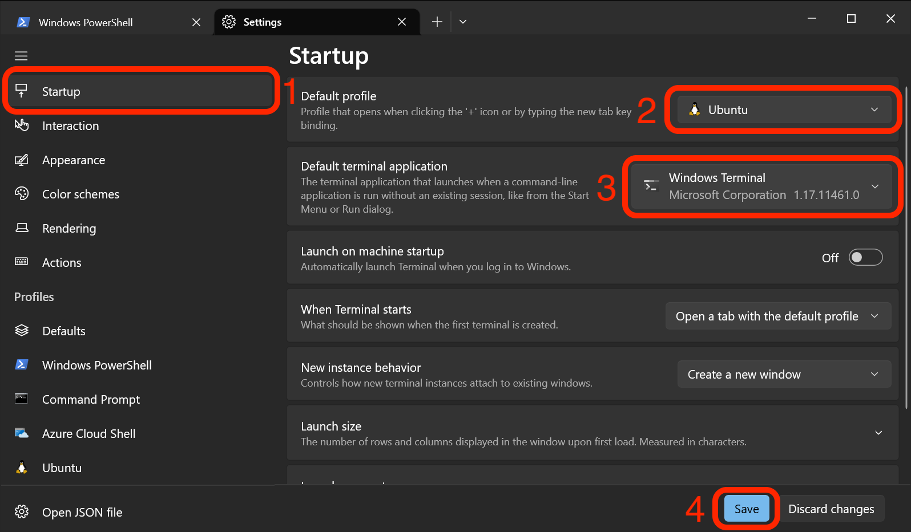

Close the **Windows terminal** app one more time.

## Launching Ubuntu

Drum roll! Launch the **Windows Terminal** application, and if everything has been successful so far, you should see a window very similar to the one below.

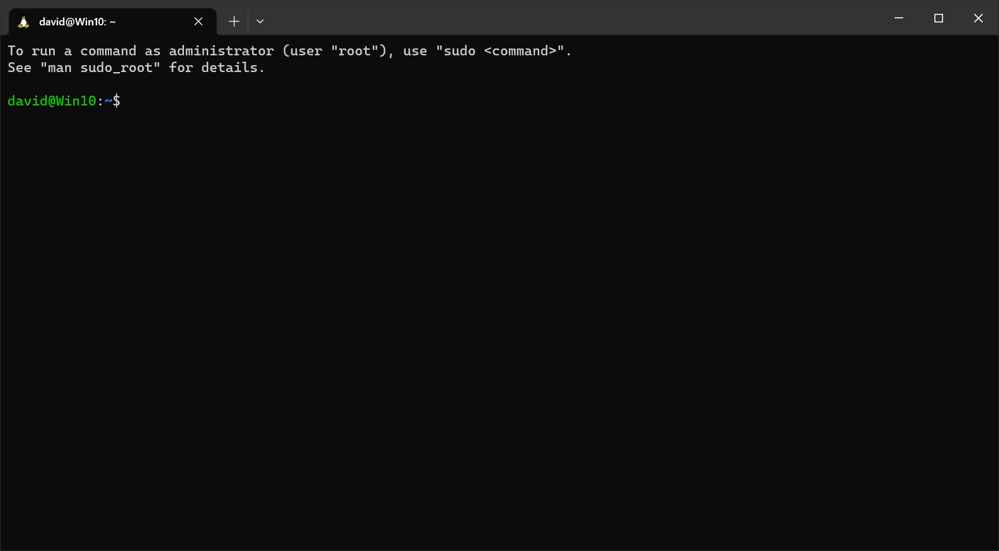

A couple of items to note:

- Windows Terminal should launch directly into the Ubuntu environment.
- The command line prompt should read `Your_Ubuntu_Username@Your_Device_Name:~$`. As shown above, the Ubuntu Username is `david`, and the device name is `Win10`. Yours will be different. The `~` represents that we are in the *current user's home directory*.

## Updating and upgrading packages

Windows *does not* manage your Linux installation and will not automatically update it. To manually do so, use this command:

```bash
sudo apt update && sudo apt upgrade
```

Do this now. Enter your Ubuntu password when prompted, and accept the changes to be made by entering **`Y`** when prompted to continue.

After that process is complete, it’s time to ensure you're upgraded to the newest LTS version of Ubuntu.

## Upgrading Ubuntu

Close any open Windows Terminal sessions and re-launch the Windows Terminal application. Run this command to start the update:

```bash
sudo do-release-upgrade
```

There are three possible outcomes from this command:

- The first is that you’ll receive a message that prints a message including the phrase: **There is no development version of an LTS available**. If that’s the case, continue from the **Zsh** steps below.
- The second is that you’ll be prompted multiple times to confirm that you would like to proceed with adding, removing, and changing various packages - proceed each time you are prompted. When this process has finished, reboot your machine.
- The third is that you have encountered an error message; check out the **Handling errors 💔** section below.

### Handling errors 💔

You may see this printed to the terminal after you run `sudo do-release-upgrade`:

```plaintext
You have not rebooted after updating a package which requires a reboot. 
Please reboot before upgrading.
```

If you see this message, restart your computer and retry the **Upgrading Ubuntu** step.

## Zsh

Bash is Ubuntu's default shell (command interpreter), but Z shell is more commonly used in modern systems by default, so that's what we will use. Install it with this command, and accept the changes to be made by entering **`Y`** when prompted to continue:

```bash
sudo apt install zsh
```

Verify the installation with this command:

```bash
zsh --version
```

The version number should be 5.8 or greater

Make Zsh the default shell with this command. Enter your Linux password when prompted.

```bash
chsh -s $(which zsh)
```

Close Ubuntu and the Windows Terminal session with this command:

```bash
logout
```

Launch the Windows Terminal application. As shown below, you should be prompted to run a configuration setup for new users:

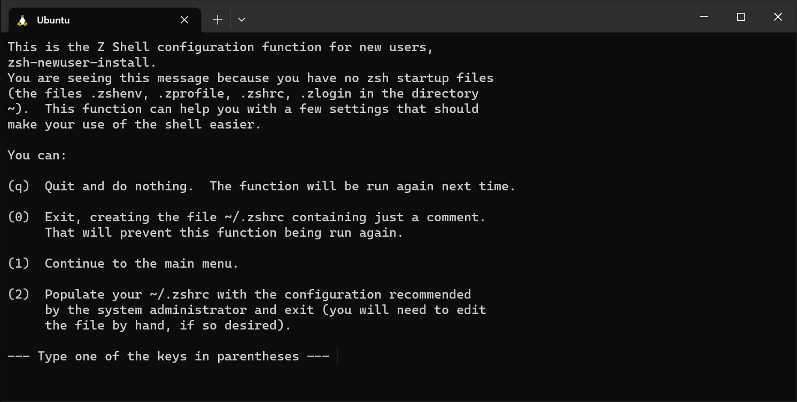

Enter `2` to accept the default configuration.

Your terminal prompt should look a little different now!

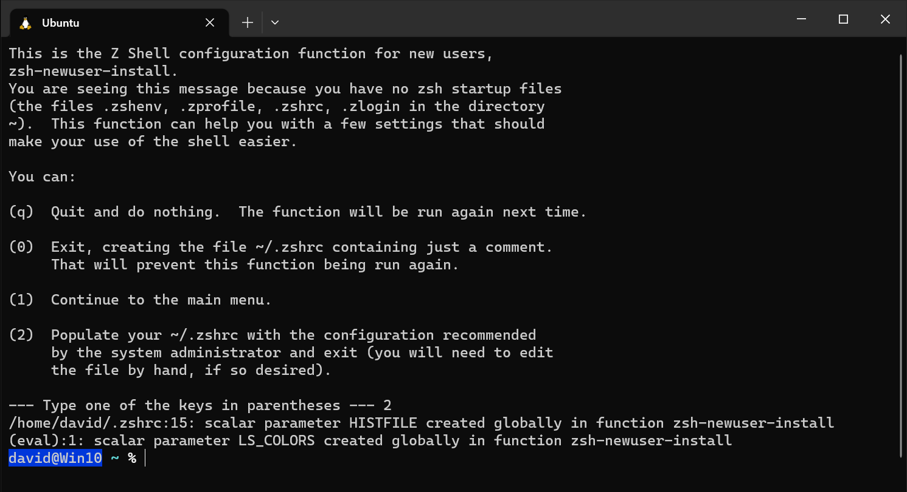

Let's confirm it worked with this command:

```bash
echo $SHELL
```

This should print **`/usr/bin/zsh`**.

## Oh My Zsh

We will also install Oh My Zsh - an open-source, community-driven framework for managing your Zsh configuration. Use this command:

```bash
sh -c "$(curl -fsSL https://raw.githubusercontent.com/ohmyzsh/ohmyzsh/master/tools/install.sh)"
```

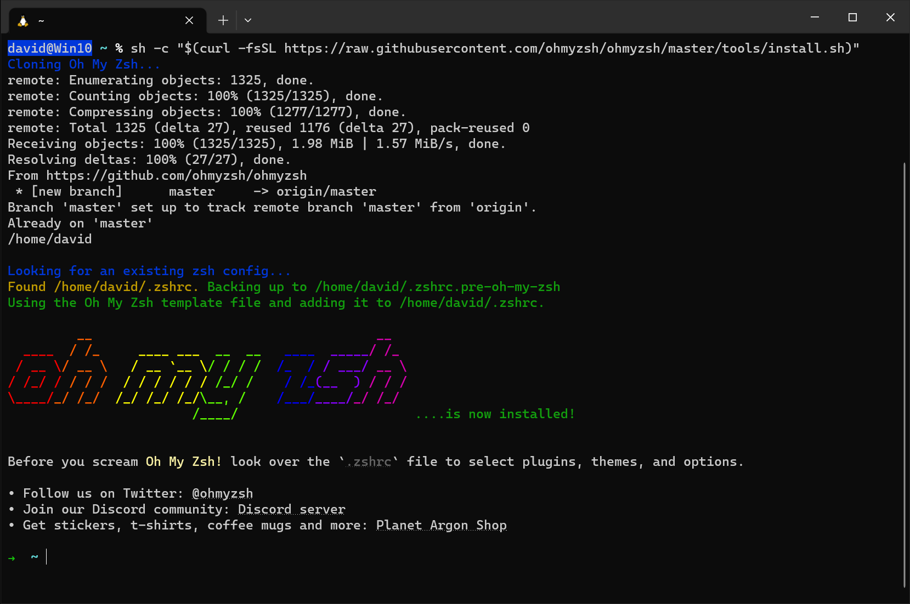

Note that your prompt has now changed to simply be `~`. This is the desired outcome!

## Visual Studio Code

Install Visual Studio Code from **[the Visual Studio Code site](https://code.visualstudio.com/)**. Install Visual Studio Code on Windows - not in the WSL file system. Accept any default options provided during the setup; there is no need to modify these selections.

### Install the WSL extension

Once VS Code is installed, continue by going to the **[WSL extension](https://marketplace.visualstudio.com/items?itemName=ms-vscode-remote.remote-wsl)** page in your browser. Click the Install button as outlined in red below to open the extension marketplace in VS Code. If your browser has any security prompts asking if you want to use the link to open VS Code, accept them.

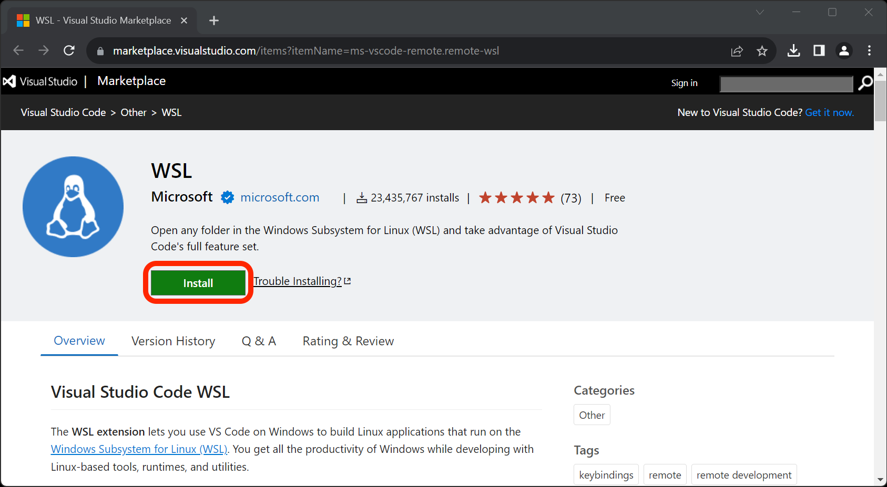

On the page for the extension in VS Code, click the **Install** button as outlined in red below.

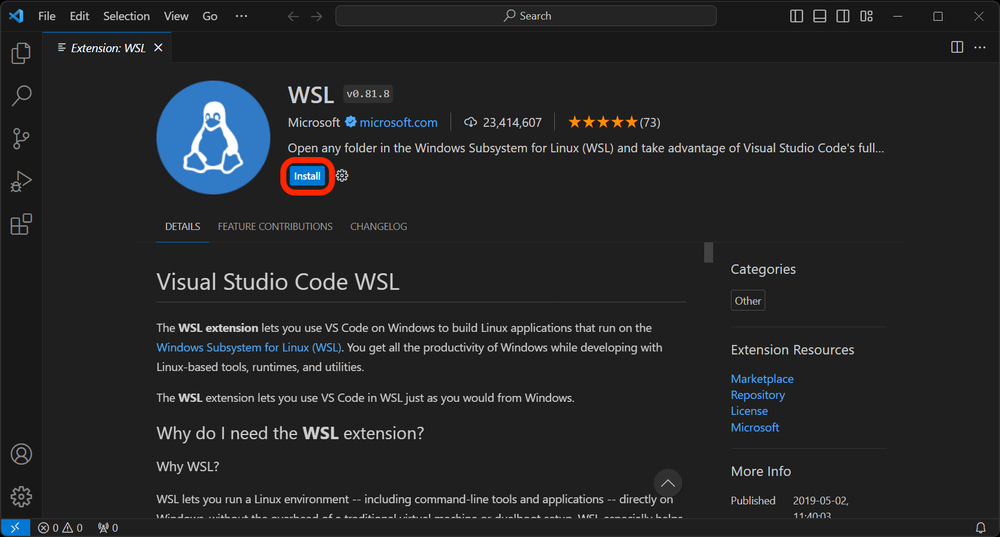

**Microsoft has this to say about running extensions on WSL:**

> The WSL extension splits VS Code into a “client-server” architecture, with the client (the user interface) running on your Windows machine and the server (your code, Git, plugins, etc) running remotely in WSL.

When running VS Code with the WSL extension, selecting the 'Extensions' tab will display a list of extensions split between your local machine and your WSL distribution.

Installing a local extension, like a theme, only needs to be done once.

Some extensions, like the Python extension or anything that handles things like linting or debugging, must be installed separately in Ubuntu. VS Code will handle this on its own, so you don't need to worry about it.

While you don't need to think too much about it, this concept is ***VERY IMPORTANT***. You are now running two separate operating systems simultaneously on your machine. When something is installed in one operating system, the other will not know about it! Let's explore this concept more.

## GitHub (GH)

At its core, GitHub (commonly abbreviated as GH) is a service for hosting Git repositories (which we'll talk about soon) in the cloud, but it also enables developers to collaborate on projects much more effectively. It might help to think of it as a social media platform for you and more than 100 million developers worldwide.

If you don't have an account there, create one now. Visit **[`https://github.com`](https://github.com)** and sign up. While there are paid account tiers, GitHub offers a very generous free tier that offers more than you need for the course.

## Git in Windows 10

While you could use Git on Windows as a source control manager, we won't be for our purposes - instead, we will use it mainly for its credential management features. Download Git for Windows 10 from **[here](https://git-scm.com/downloads)**. Follow the installation instructions below.

***Do not change the install location.***

***You will be given many prompts on features to install and choices to make while installing Git. All of these may be left as their default, except for the ones below.***

Unless you have a specific need for the features unchecked, it's recommended you use only install the checked components below:

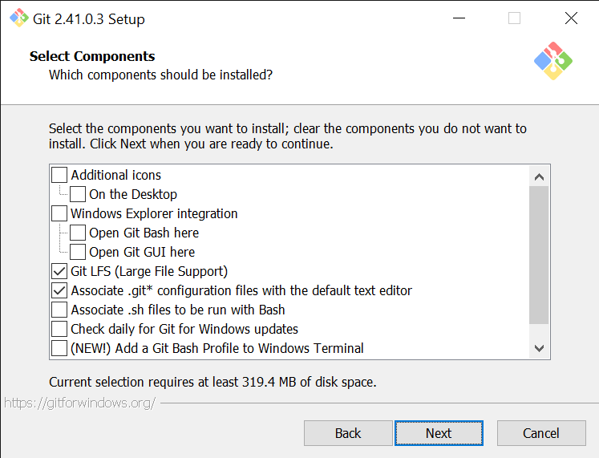

Note we have unchecked some features not required for our purposes that may only be confusing, get in the way, or waste hard drive space.

Again, we won't be using Git features on the Windows side, so having a Start Menu folder would only be confusing and create clutter - select the option for **Don't create a Start Menu folder**.

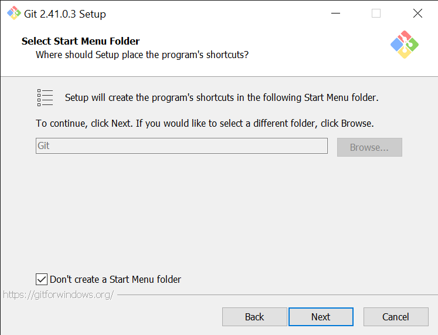

When prompted, you should select Use Visual Studio Code as Git's default editor (this does not really matter now, but if you ever use Git in Windows for any reason in the future, this will already be set up for you).

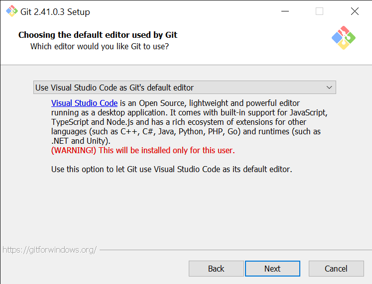

We'll be using the `main` branch for all our work. Go ahead and set this up now. Again, this setting won't directly impact us as we use Ubuntu, but if you ever do use Git for Windows in the future, you won't have to do this work again later. `main` as the default branch name is the future.


Continue from this point, leaving all other settings as their default.

Finally, when installation has been completed, you can uncheck **View Release Notes** and hit **Finish**!

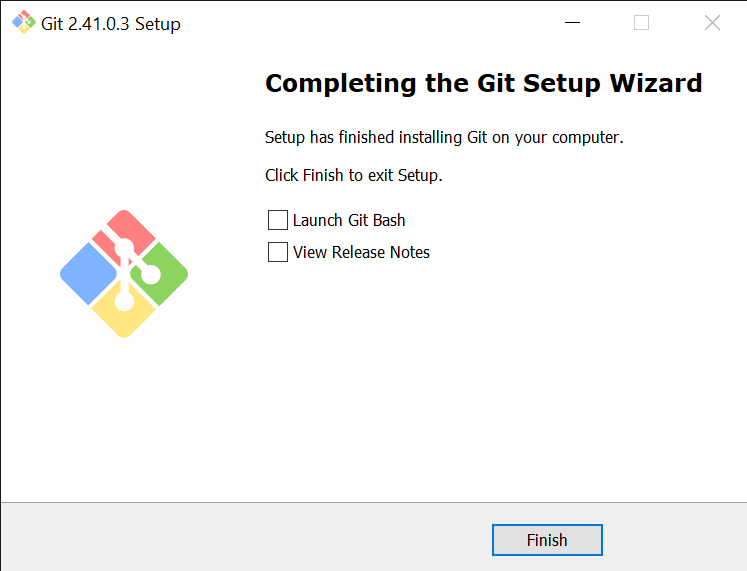

You’ve completed the installation of Git on Windows. Now on to Ubuntu!

## Git in Ubuntu

Close any open **Windows Terminal** sessions and re-launch the **Windows Terminal** application.

Git comes pre-installed with Ubuntu, but ensure you have the most recent stable version with:

```bash
sudo add-apt-repository ppa:git-core/ppa
```

You may be prompted for your Ubuntu password. If you are, enter it. When prompted to continue, press **`Enter`**. If you encounter an error during this process, check out the **Handling errors 💔** sub-section below.

Then enter:

```bash
sudo apt-get update
```

and then finally, use this command to install Git on your machine:

```bash
sudo apt-get install git
```

Enter **`Y`** when prompted to continue.

### Handling errors 💔

After running the `sudo add-apt-repository ppa:git-core/ppa` command above, you may encounter an `HTTPError`. If you do, ensure that your system date and time are correct, then try the same command again. If this does not resolve your issue, reach out to your Installfest point of contact for assistance!

## Git config

With Git installed, we can now make some configuration changes to make it a more effective tool. Complete all of the following configuration steps.

Use the below command to add a user name to Git, which will be used to identify your commits. Replace `User Name` with a name of your choice. Make sure you leave the quotes surrounding your username. Keep the name somewhat professional, or just use your name - this will be used to identify your commits on GitHub. There will not be any output from this command.

```bash
git config --global user.name "User Name"
```

Next, use the below command to add an email to Git, which will be used to identify your commits. Replace `user@email.com` with the email address associated with your **[`https://github.com`](https://github.com)** account. **The email you provide MUST match the email address associated with your GitHub account.** Ensure you leave the quotes surrounding your email. There will not be any output from this command. If you don’t have a **[`https://github.com`](https://github.com)** account yet, create one before you run this.

```bash
git config --global user.email "user@email.com"
```

Set the default branch name to `main` with the below command. There will not be any output from this command.

```bash
git config --global init.defaultBranch main
```

Set the default Git editor to VS Code with the below command. There will not be any output from this command.

```bash
git config --global core.editor "code --wait"
```

By default, Git will ask for a new commit message when commits are brought into a Git repo. The following command will force the default commit message for all those commits instead of prompting you to add a commit message. While this isn’t a Git command, we’re still tackling it as part of this section since it changes Git's behavior. There will not be any output from this command.

```bash
echo "export GIT_MERGE_AUTOEDIT=no" >> ~/.zshrc
```

Turn off rebasing as the default behavior when pulling from a repo with the below command. There will not be any output from this command.

```bash
git config --global pull.rebase false
```

Finally, all that work we just did to get Git up and running on Windows is about to pay off: Make the Ubuntu installation of Git use the Windows Git Credential Manager Core:

```bash
git config --global credential.helper "/mnt/c/Program\ Files/Git/mingw64/bin/git-credential-manager.exe"
```

Now, any Git operation you perform within Ubuntu will use the Git Credential Manager managed by the Windows installation of Git. There will not be any output from this command.

You may have noticed from the command above all the files you have stored in Windows are available on the Ubuntu side in **`/mnt/c`**, but accessing them comes at a significant performance cost. Therefore, the code you write will be stored in the Ubuntu storage space, and we'll only interact with Windows files and apps when necessary. Additionally, the Ubuntu storage space can be accessed from Windows at **`\\wsl$\Ubuntu\`**.

You shouldn't have to bring files from Windows to Ubuntu or Ubuntu to Windows often, but the above information may be useful to you in certain circumstances.

### Configuring a `.gitignore_global` file

***Note: This step is vital to getting a job after the course. If you do not complete these steps exactly, it will look extremely bad to a future employer when they look over your GitHub repos.***

Proper code, utilities, and the use of Git ignore files prevent us from uploading private secrets to the internet.

A global Git ignore file (**`.gitignore_global`**) will prevent us from uploading private secrets to the internet across all of your projects so that you don't have to worry about making the appropriate entries in every project's Git ignore file.

Use this command to create a **`.gitignore_global`** file in the user directory:

```bash
touch ~/.gitignore_global
```

There will not be any output from this command.

Next, configure Git to use this file:

```bash
git config --global core.excludesfile ~/.gitignore_global
```

Open the new **`.gitignore_global`** file in VS Code:

```bash
code ~/.gitignore_global
```

Since this is likely the first time you are running the `code` command, you'll see an output like the one below.

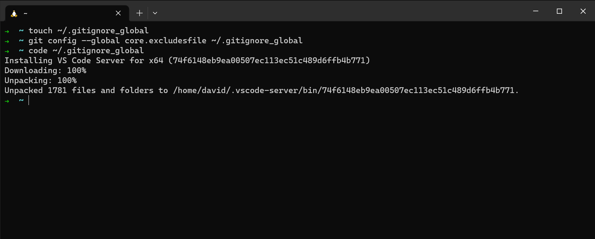

This may be your first time launching VS Code to work with an actual file. If so, congrats! You'll arrive at a page that should look a lot like this:

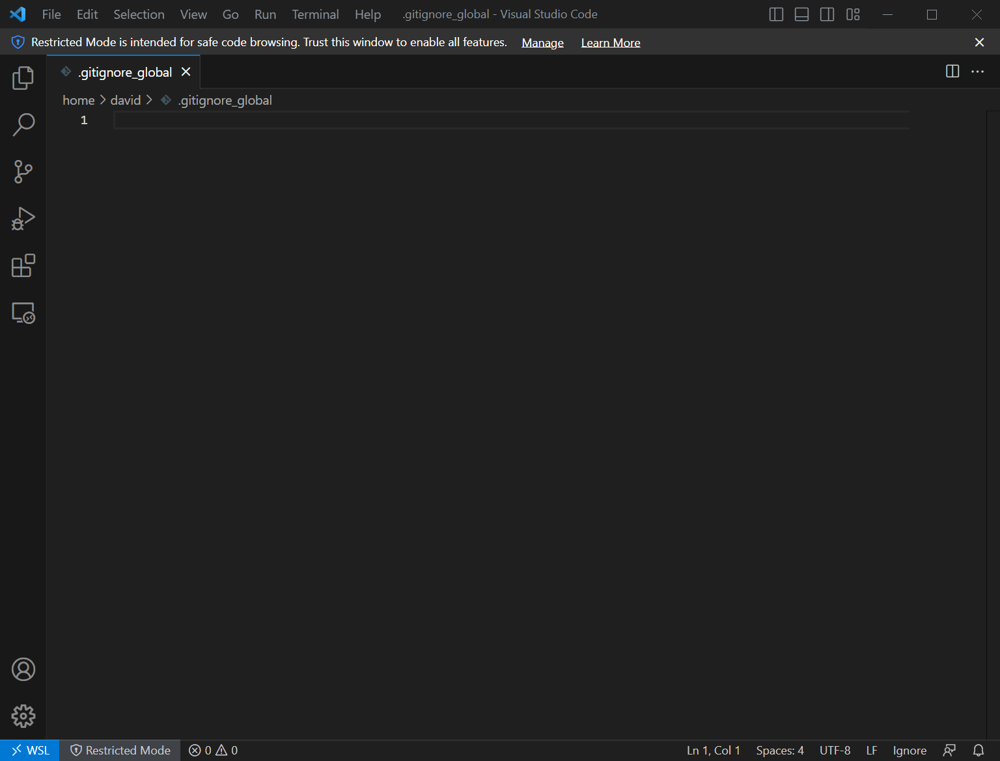

Here, you see the new **`.gitignore_global`** file open in VS Code. Note the **WSL** icon in the lower-left corner.

### Here is a [.gitignore_global file for you to use](../global-git-ignore.md)

Open the above page and copy the contents of the code block from the page with the copy button. Note that you must be logged in to your GHE account to access this page!

Return to VS Code, then click inside the editor (the main portion of the VS Code window).

Paste the contents of the file you copied into the editor in VS Code. Doing this should result in your VS Code window looking similar to this:

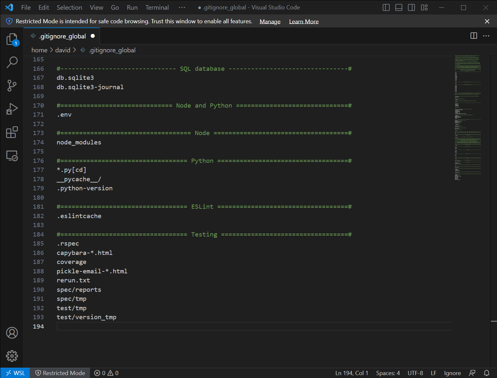

Congrats, you just edited your first file in VS Code! This is a great time to turn on **Auto Save**! The **Auto Save** setting is in the **File** menu - select it, then re-open the **File** menu to ensure that there is a checkmark next to the **Auto Save** option, as shown below.

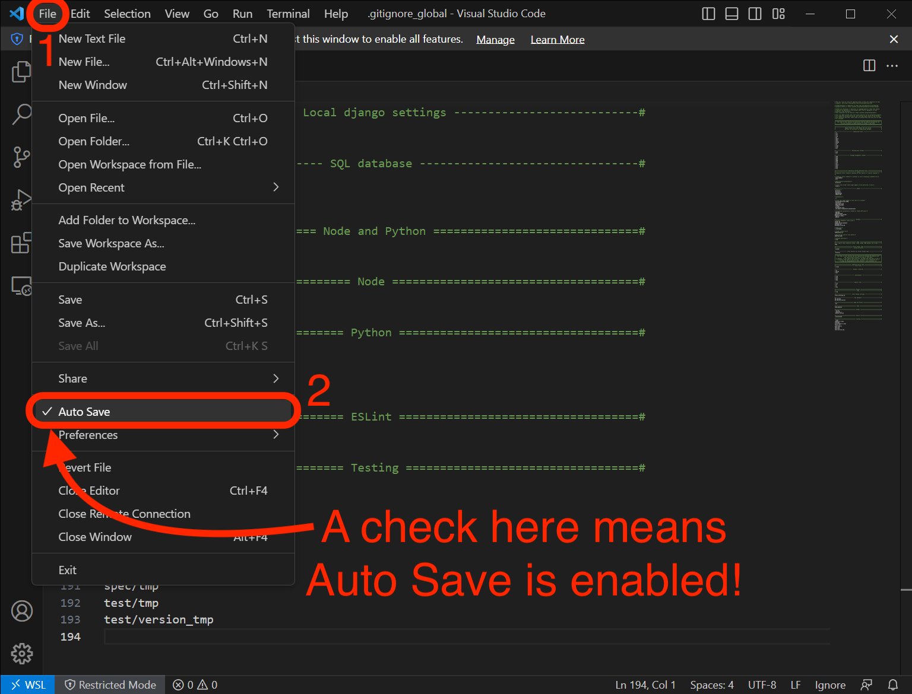

This should save the file, but let's be sure by manually saving it by using **Save** in the **File** Menu or pressing **`Ctrl + S`**.

You can close VS Code for now.

## Node.js

Use this command to install `nvm`, which we will use to install Node.js. `nvm` stands for [Node Version Manager](https://github.com/nvm-sh/nvm) and can be used to swap between different versions of Node.js quickly. We won't swap between different versions in the course, but it's still a handy tool for managing our Node.js install and can help you manage your Node.js installation post-course. Get `nvm` with this command:

```bash
curl -o- https://raw.githubusercontent.com/nvm-sh/nvm/v0.39.7/install.sh | bash
```

You may see this prompt part way through the install process:

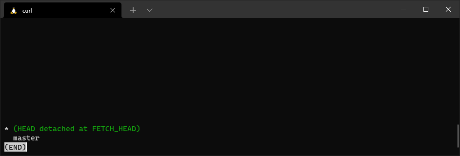

If you do, just hit **`q`** - that will exit this screen and return you to the below install process. If you don't get this error, that's great; continue until you see the completed installation of `nvm`:

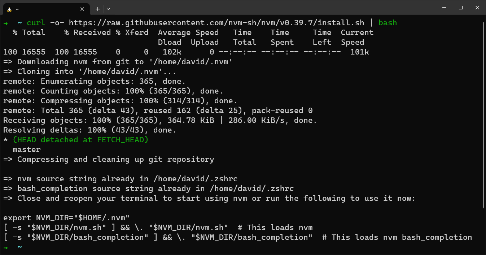

**Restart the Windows Terminal application now.**

After starting up the Windows Terminal again, run this command to check the version of `nvm`:

```bash
nvm --version 
```

If you do not get a version number, check out the **Handling errors 💔** subsection below; otherwise, continue.

Use nvm to install node version 20 with this command:

```bash
nvm install 20
```

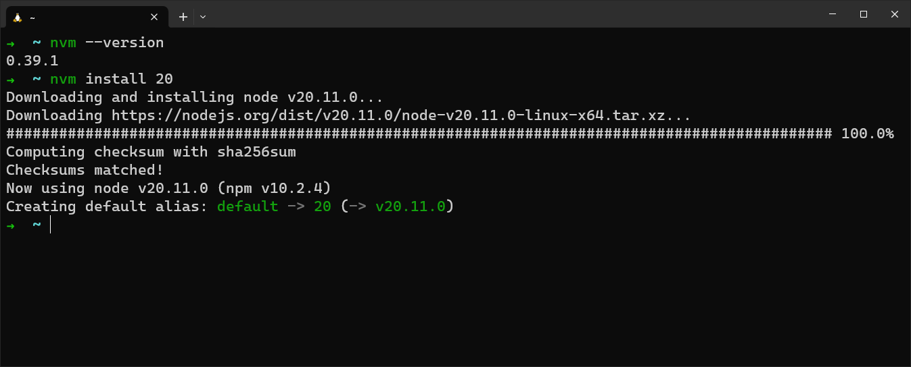

A successful install of node v20.11.0. Your version may be slightly different from this, but as long as it starts with 20 everything is ok!

### Handling errors 💔

#### command not found: nvm error

Copy this command block and run it in the terminal, which will point to the nvm directory in your **`~/.zshrc`** file:

```bash
cat << EOF >> ~/.zshrc

export NVM_DIR="$HOME/.nvm"
[ -s "$NVM_DIR/nvm.sh" ] && \. "$NVM_DIR/nvm.sh"  # This loads nvm
[ -s "$NVM_DIR/bash_completion" ] && \. "$NVM_DIR/bash_completion"  # This loads nvm bash_completion
EOF
```

Restart your terminal. You should now be able to run the `nvm --version` command and get a version number in response. If you do not, alert your installfest point of contact.

### NPM config

Run this command to disable `npm` update notifications since this process is managed by `nvm`:

```bash
npm config set update-notifier false
```

There will be no output after running this command.

## nodemon

With Node.js installed, install `nodemon` globally with this command:

```bash
npm i -g nodemon
```

If nodemon has successfully installed, this should be the output:

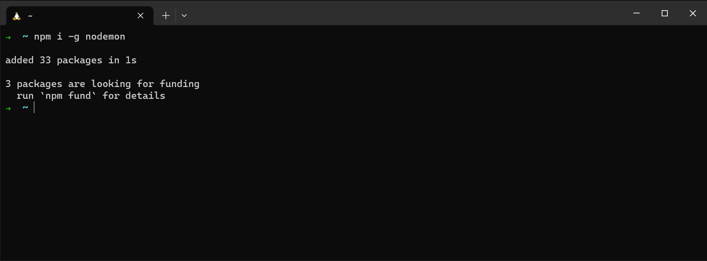

## `~/code` directory

You'll need somewhere on your computer to put all of your work in the course - that's what the `~/code` directory will be for you! All course content assumes you will have this directory, so let's create it now with this command in your terminal:

```bash
mkdir ~/code
```

## OH WOW YOU DID IT!

You are now set up to start developing in Linux on Windows! Be very proud of yourself; that was quite the process!

## Microsoft PowerToys (optional, but recommended)

From Microsoft:

> Microsoft PowerToys is a set of utilities for power users to tune and streamline their Windows experience for greater productivity. Inspired by the Windows 95 era PowerToys project, this reboot provides power users with ways to squeeze more efficiency out of the Windows 10 shell and customize it for individual workflows.

Among its many useful tools, PowerToys includes one of the best window managers for Windows: FancyZones, which allows you to customize window layouts and get the best setup just for you.

Get PowerToys **[here](https://github.com/microsoft/PowerToys/releases/download/v0.71.0/PowerToysSetup-0.71.0-x64.exe)**.

Learn more about FancyZones **[here](https://docs.microsoft.com/en-us/windows/powertoys/fancyzones)** and the rest of the tools that come with PowerToys **[here](https://docs.microsoft.com/en-us/windows/powertoys/fancyzones)**.
