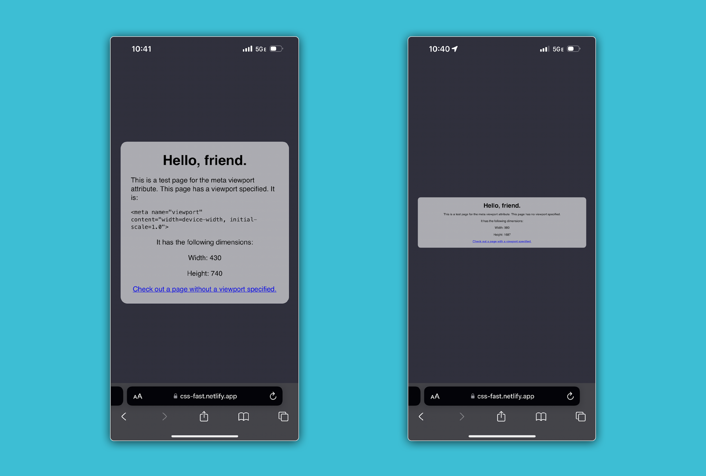

# 

**Learning objective:** By the end of this lesson, students will be able to implement a mobile-first design approach and use the viewport meta tag to optimize web pages for mobile devices.

## Mobile-first design philosophy

Two approaches can be followed when writing CSS for a website:

1. Write the starting CSS for a large desktop screen, then apply styling targeting smaller screens as the screen width decreases.
2. Write the starting CSS for a mobile screen, then apply styling as the width increases. This is referred to as mobile-first design.

Typically, a mobile-first approach (#2 above) is preferable for a few reasons:

- Mobile-first helps encourage thought about what content is the most important - and ensures we know to prioritize that content. Once we know the minimum requirements, we can add additional features for other devices that can handle them.
- Although not ideal, a design based on small screen width is usable on larger screens. However, the reverse is often not the case. If necessary, we can rely on just the design for smaller screens, knowing it will cover everything.

## The first step to enabling a better experience on mobile

Unlike desktop browsers that essentially render pixel-by-pixel, mobile browsers render to a virtual viewport. The virtual viewport is what enables pinch-to-zoom on mobile browsers. Mobile browsers scale down page content to fit it into the viewport by default.

This default results in tiny text that may be hard to read but does at least make older sites usable with pinch-to-zoom. This was necessary when mobile devices with fully-featured browsers were first released since websites weren't built to work on mobile devices.

So, how do you get a website to feel native to a mobile device?

### Viewport `meta` tag

The following should look familiar from the boilerplate HTML code you've used before:

```html
<meta name="viewport" content="width=device-width, initial-scale=1.0">
```

This HTML informs the browser not to scale the page on a mobile device. With this HTML present, mobile devices instead display page content based on the device's width (as specified by `width=device-width`) and do not zoom out `initial-scale=1.0`.

This viewport `meta` tag is so essential that it is one of the few items automatically included in VS Code's HTML boilerplate. Every app you write will have this meta tag.

Below is an example of a page with the viewport meta tag on the left and the same page without it on the right:


