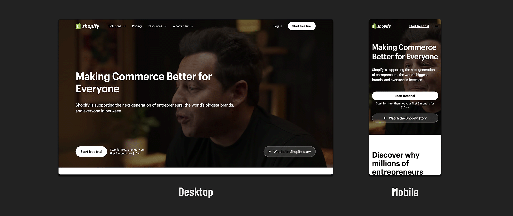
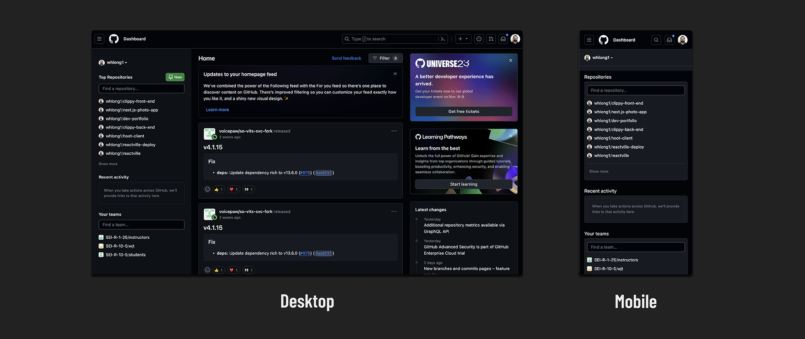

# 

**Learning objective:** By the end of this lesson, students will be able to identify examples of responsive design in real-world websites and understand how they tailor user experience based on device type.

## Responsive design in the real world

Again, you encounter responsive design on almost any site you visit on the web, but these are solid examples:

[Shopify](https://www.shopify.com/) offers an example of using responsive design to elevate a message.

When you go to their site, whether on a mobile device with a five-inch screen or a desktop device with a 34-inch screen, the first thing you see is a *call to action*.

A call to action is a prompt that urges a user to take a specific action. Typically, a call to action will lead to the user becoming a customer. In this case, the call to action asks the user to sign up for a trial.

Some of the techniques Shopify used to accomplish this are as follows:

- Responsive image: The background image for mobile is much smaller than in desktop.
- Responsive nav bar: The nav stretches across the screen on a desktop view. On mobile, it's initially hidden, and users can press a hamburger icon to show it.
- Layout orientation: The "Start free trial" and "Watch the Shopify story" buttons are positioned horizontally across from each other on the desktop. On mobile, they are stacked vertically. It's typical to display most content vertically for mobile devices, given the limited width of their screens.

Another example of a responsive site is one you've become familiar with - [GitHub](https://github.com).

GitHub's responsive design goes further than just design considerations. Their responsive design goes as far as hiding certain features on mobile devices. This works for GitHub's users because the likelihood of someone wanting to create a repo on a mobile device is minimal.

While their users may not create repos from their mobile devices, they will likely use its social features. Therefore, these features are given more prominence.

Many approaches can be taken to implement responsive design, and the final implementation will ultimately depend on the goals of the application in question.
