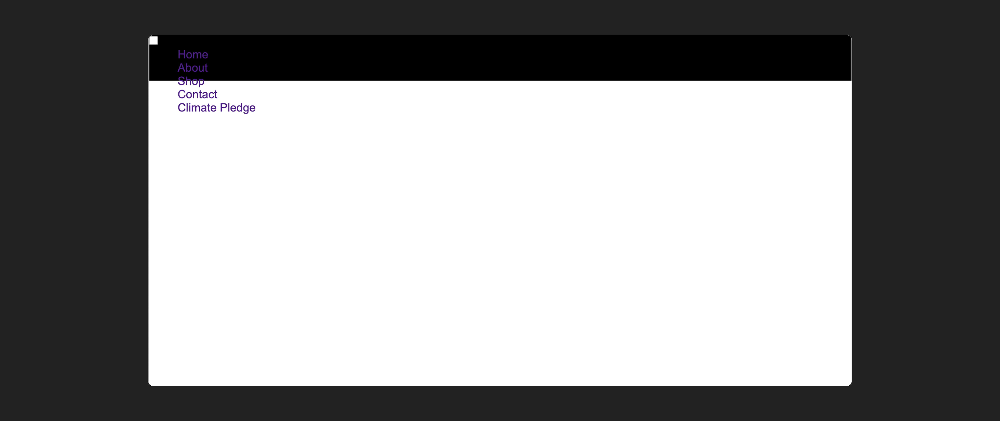
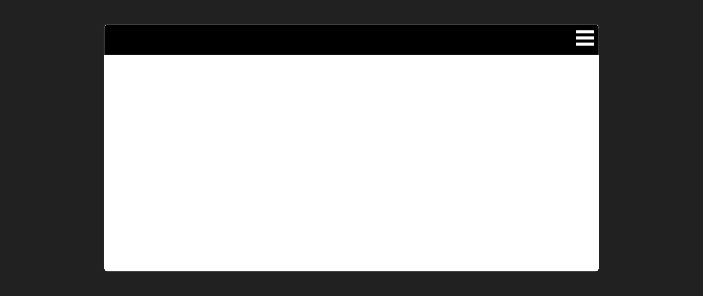
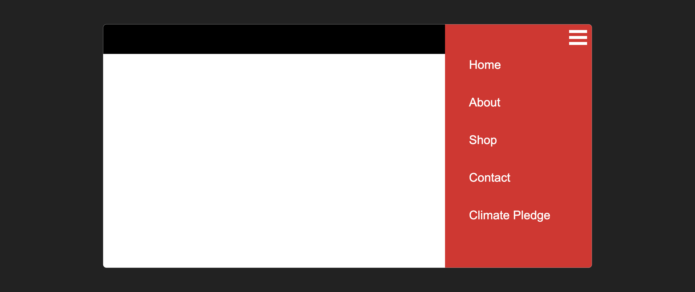

# 

**Learning Objective:** By the end of this lesson, the learner will understand how to create a functional hamburger navigation menu using pure CSS. This will include using a checkbox for toggling visibility and styling the menu to improve user experience.

In order to make our navbar functional using pure CSS, we're going to overhaul most of the code from the [Media Queries](../media-queries/README.md) lesson.

## Setting up our navbar

In our `index.html` we'll keep our `css/style.css` linked.

We're going for a slightly different look this time, ditching the hamburger emoji for a more classic navbar style.
Replace your existing HTML `<header>` with the following code:

```html
  <header class="header">

    <label id="hamburger-icon" for="hamburger-btn">
      <div class="line"></div>
      <div class="line"></div>
      <div class="line"></div>
    </label>
    <input id="hamburger-btn" type="checkbox" />

    <nav>
      <ul class="menu">
        <li><a href="/">Home</a></li>
        <li><a href="/">About</a></li>
        <li><a href="/">Shop</a></li>
        <li><a href="/">Contact</a></li>
        <li><a href="/">Climate Pledge</a></li>
      </ul>
    </nav>

  </header>

```

To make our hamburger menu work its magic, we'll use a `checkbox input` that'll be visible on mobile devices. This way, we can dynamically style the menu depending on whether the checkbox is checked or not. The `<label>` tag above the checkbox lets us define the "icon" that represents our hamburger menu.

## Styling our UI

Now it's time to style our navbar. Delete all rules in your `css/style.css`. and add the following code instead:

```css
/* reset our css */
* {
  margin: 0;
  box-sizing: border-box;
}

body {
  background-color: #ffffff;
  font-family: Arial, Helvetica, sans-serif;
}

a {
  text-decoration: none;
}

ul {
  list-style: none;
}

```

Now that we've got some basic css rules, let's add styling to our header:

```css
/* style the header */
.header{
  top: 0;
  width: 100%;
  height: 64px;
  position: sticky;
  background-color: #000000;
}

```

By adding `position: sticky` and `top: 0` to our `.header` class, we're telling the header to stay put at the top of the screen even as we scroll down.

Our CSS styling gives us a somewhat decent-looking navbar, but there are a couple of issues: the checkbox is visible, and the link text color is hard to read.



Let's fix that!

```css
/* Nav menu */
nav {
  top: 0;
  position: fixed;

  right: -100%;
  width: 300px;
  height: 100%;

  overflow: hidden;
  padding-top: 48px;
  transition: right 0.5s;
  background-color: #E41F26;
}

nav a {
  display: block;
  padding: 24px 8px;
  color: white;
  font-size: 24px;
  font-weight: 500;
}

```

Here we use `position: fixed` to make our menu overlay the content that will reside within our `<main>` tag.

We've added a `block` display to our menu links, included the `transition` property for smooth animations, and set a `right` of `-100%` to keep our `nav` element hidden until the checkbox is clicked.

Note we are targeting the `nav` element here. If you have more than one `nav` element you'll need to adjust this code.

Now it's time to style the hamburger icon:

```css
#hamburger-icon {
  z-index: 1;
  top: 10px;
  right: 10px;
  position: absolute;
  cursor: pointer;
}

.line {
  width: 36px;
  height: 6px;
  margin: 6px;
  background-color: #ffffff;
} 

#hamburger-btn {
  display: none;
}
```

In the above code, we styled our `cursor` to display as a `pointer` when a user interacts with our menu.

We also positioned our hamburger label to the right of our header, and created a hamburger icon using the `.line` class.

Finally, we hid our checkbox using `display:none` under our `#hamburger-btn` declaration.

As of now, we have an output that looks like this:



Now let's make that hamburger icon interactive:

```css
/* Toggle menu icon */
#hamburger-btn:checked+nav {
  right: 0;
}

```

This code uses the adjacent sibling combinator (`+`) to select the `nav` element that is directly preceded by a checked checkbox with an id of `hamburger-btn`.

When the checkbox is checked, the `right` property of the `nav` is set to 0, instead of the initial value of `-100%;`. This causes the nav to slide in from the right side of the screen

Our toggled menu now looks like this:



### Key Takeaways

**Checkbox for Toggling:** We used a checkbox input to change the menu's visibility. It's an HTML element we can style and manipulate using CSS.

**Styling the Menu:** We set the menu's right property to -100% to keep it hidden. When the checkbox is checked, we change it to 0, revealing the menu.

**Responsiveness:** We use position: fixed for the menu to overlay it on top of other content. The fixed position also makes the menu accessible from any point on the page.

**Enhanced UX:** The transition property provides smooth animation for better user experience.

**Visibility Control:** The display: none property is used to hide the checkbox, keeping our layout clean.

**Accessibility:** Always use proper attributes and tags, like label for the checkbox, to improve accessibility.

**Positioning:** The position: sticky CSS property is used to make the header stay at the top during scrolling.
