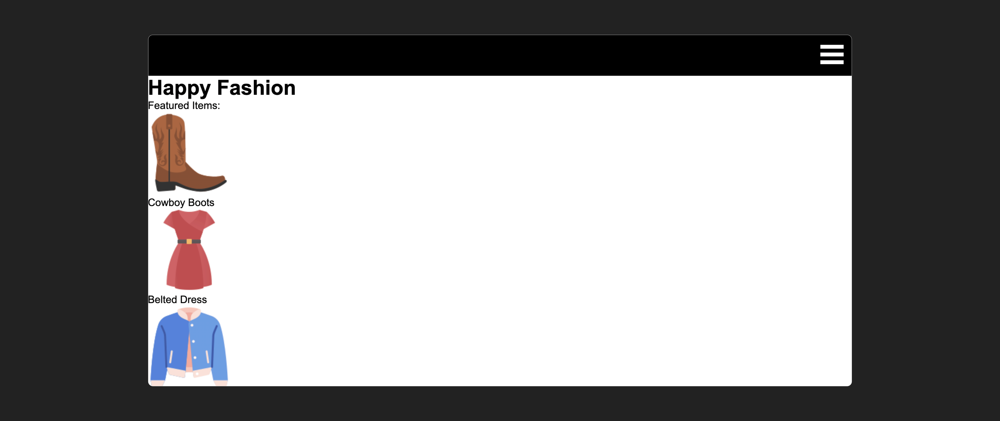
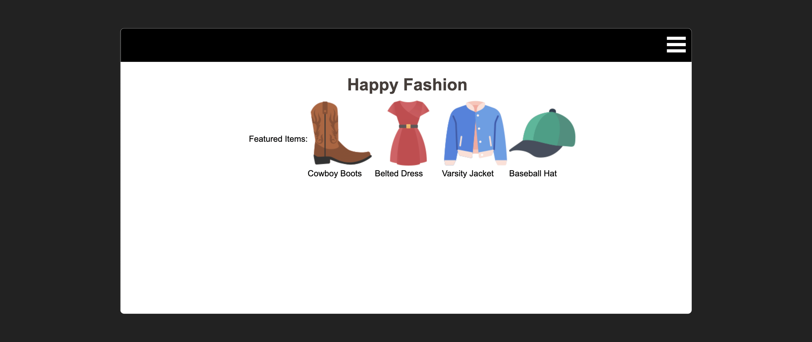
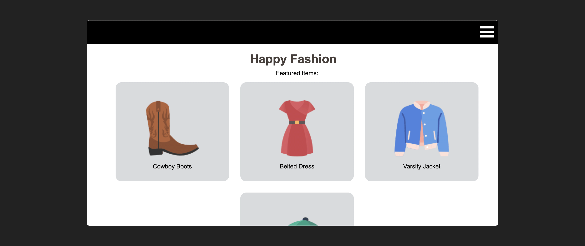

# 

**Learning objective:** By the end of this lesson, the learner will be able to implement a responsive product card layout using flexbox, while adhering to proper attribution requirements for third-party assets.

Remember that awesome hamburger menu we built in the [Functional Hamburger Nav](./functional-hamburger-nav.md) level up? In this lesson we'll add content and responsiveness to the main content of our site using only flexbox!

In `index.html`, add the following code below the closing `</header>` tag:

```html
<main>
  <div class="brand-text">
    <h1>Happy Fashion</h1>
  </div>
  <div class="card-container">
    <div class="title-text">
      <p id="card-title">Featured Items:</p>
    </div>
    <div class="item-card">
      
      <p class="item-desc">Cowboy Boots</p>
    </div>
    <div class="item-card">
      
      <p class="item-desc">Belted Dress</p>
    </div>
    <div class="item-card">
      
      <p class="item-desc">Varsity Jacket</p>
    </div>
    <div class="item-card">
      
      <p class="item-desc">Baseball Hat</p>
    </div>
  </div>
</main>
```

We've now added a few cards with links to icons from [Flaticon](https://www.flaticon.com/), a fantastic resource for finding high-quality, free icons and assets to enhance your projects. However, it's important to note that Flaticon has strict attribution requirements, so make sure to properly credit them in your work.

Our output should look like this:



Moving on, let's style our `.brand-text` `<div>`. In `css/style.css`, add the following code at the bottom of your stylesheet:

```css
/* New code below: */
.brand-text {
  color: #463f3a;
  margin-top: 25px;
  display: flex;
  flex-direction: column;
  align-items: center;
  justify-content: center;
}
```

Having transformed our `.brand-text` `<div>` into a flexbox and centered the `<h1>` element within it, let's now focus on styling our `.card-container` `<div>`. This `<div>` houses each individual card, and the styling rules we apply will make it responsive without the need for a media query.

Add the following code:

```css
.card-container {
  width: 100%;
  margin: 10px;
  display: flex;
  flex-wrap: wrap;
  align-items: center;
  justify-content: center;
}
```

The key element here is `flex-wrap: wrap`, which instructs our flexbox to display its contents as a grid if the screen width permits, and as a column when the user's screen is too narrow to accommodate more than one card.

The `flex-wrap` property in CSS controls how flex items are wrapped within a flex container. Setting `flex-wrap: wrap` allows the flex items to wrap onto multiple lines when the container's width is not sufficient to accommodate all items in a single row. This ensures that the items remain responsive and adjust their layout based on the available screen space.

Our output looks a little funky right now, but after we style the individual cards it will look a lot better!



Add some rules for each card:

```css
.item-card {
  width: 300px;
  margin: 15px;
  display: flex;
  flex-direction: column;
  align-items: center;
  justify-content: center;
  padding: 30px 40px;
  border-radius: 15px;
  background-color: #d9dbdd;
}

.title-text{
  width: 100%;
  display: flex;
  flex-direction: row;
  align-items: center;
  justify-content: center;
}

img {
  width: 70%;
  margin: 15px;
}
```

That looks better!



To achieve this look, we applied additional flexbox styling to each individual card, defined a fixed `width`, incorporated `padding` and `margin`, and applied a `border-radius`. We also styled the caption text for each card and set a fixed size for the `` elements within each card.
