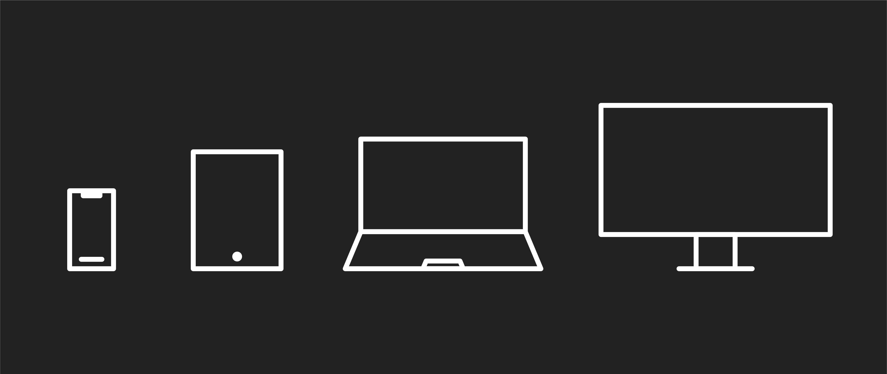

# 

**Learning objective:** By the end of this lesson, students will utilize media queries and breakpoints for creating responsive web designs.

## Using media queries to apply different CSS rules to a page

[Media queries](https://developer.mozilla.org/en-US/docs/Web/CSS/CSS_media_queries/Using_media_queries) are a CSS feature that allows us to apply different rules to a page depending on a device's characteristics. For example, we can use media queries to change the layout of our page for different screen sizes. We could even hide or show specific elements when printing the page with a printer.

To use a media query, we wrap the CSS rules we want to apply conditionally in an `@media` block. The `@media` block specifies the conditions that must be met for the CSS rules to apply.

```css
body {
  background-color: lightsalmon;
}

@media (min-width: 600px) {
  body {
    background-color: lightgreen;
  }
}
```

We can also combine multiple media queries to create more complex conditions. For example, the following media query will apply the CSS rules inside the block to all desktop devices with a screen width of less than 1200 pixels:

```css
@media (min-width: 768px) and (max-width: 1199px) {
  /* CSS rules for with a screen width of greater than 768px 
     and fewer than 1200 pixels */
}
```

## Breakpoints



Breakpoints are the specific screen sizes or conditions we use to create media queries. Common breakpoints include:

- Mobile: 320px - 480px
- Tablet: 481px - 767px
- Desktop: 768px - 1199px
- Large desktop: 1200px+

While the above values are good general guidelines, it's important to recognize that desktop users can resize their browser window to any width. Also, nothing stops a phone manufacturer from making a phone that doesn't conform to the above rules. For example the iPhone 15 Pro Max has a viewport width of over 800 pixels in landscape orientation, putting it firmly into our supposed desktop viewport territory.

Therefore, you should focus your energy on making breakpoints that make sense for your application, and you should always choose breakpoints based on a site's content.

The easiest way to do this is to drag your browser's width in and out, making it thinner and wider. Look at the website as you do so. If you feel the app becomes difficult to use at any point due to its layout at that screen width, add a media query that targets that screen width and write CSS that corrects the issue.

## Order matters

The order in which we write media queries matters. For example, if two media queries apply to the same device, the browser will use the second one that matches, even if it's not what you might have intended.

Let's say we wanted to create a design where we intend to apply these rules:

- The background of the body element should be `lightsalmon` when the viewport is smaller than 600 pixels in width.
- The background should be `lightgreen` when the viewport is between 600 pixels and 800 pixels in width
- The background should be `gainsboro` when the viewport is 800 pixels wide or more.

This CSS would help accomplish these goals:

```css
body {
  background-color: lightsalmon;
}

@media (min-width: 600px) {
  body {
    background-color: lightgreen;
  }
}

@media (min-width: 800px) {
  body {
    background-color: gainsboro;
  }
}
```

If the viewport is 900px wide, the background will be gainsboro, as intended. But the cascade still applies to media queries, so if we start moving our rules around, then things will start to break:

```css
@media (min-width: 600px) {
  body {
    background-color: lightgreen;
  }
}

@media (min-width: 800px) {
  body {
    background-color: gainsboro;
  }
}

body {
  background-color: lightsalmon;
}
```

Because the last `body` rule in the document applies universally and sets the background color to `lightsalmon`, the background color will always be `lightsalmon`, no matter how wide the browser viewport is.

Here's another example:

```css
body {
  background-color: lightsalmon;
}

@media (min-width: 800px) {
  body {
    background-color: gainsboro;
  }
}

@media (min-width: 600px) {
  body {
    background-color: lightgreen;
  }
}
```

Here, we've moved the main `body` rule back to the top and moved the media query for screens 600 pixels and larger to the bottom. This change makes it so that when the viewport width is 600 pixels or larger, the background color will be `lightgreen` (and `lightsalmon` when the viewport is less than 600 pixels). Again, because of the cascade, the background color will never be `gainsboro`.

Note we could use multiple media queries to make the media query for screens 600 pixels and larger a little more specific so that it doesn't apply to all screens above 600 pixels, like so:

```css
body {
  background-color: lightsalmon;
}

@media (min-width: 800px) {
  body {
    background-color: gainsboro;
  }
}

@media (min-width: 600px) and (max-width: 799px) {
  body {
    background-color: lightgreen;
  }
}
```

When the screen is 800 pixels or larger, the background color will change to `gainsboro`, as we originally intended.

The big takeaway is that, like always, the order in which you write your CSS matters. However, media queries add layers of complication you must also consider. Media queries should always appear after all other CSS, and it's important to test your implementation of them.
