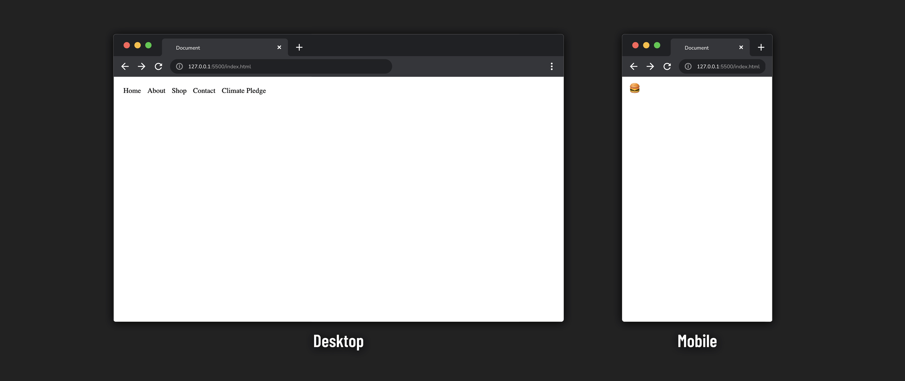

# 

**Learning objective:** By the end of this lesson, students will implement a responsive hamburger nav bar using media queries.

## Hamburger nav bar

Let's create a responsive nav bar for a shopping site with a non-functioning hamburger button using media queries! You've interacted with a hamburger button before, even if you haven't heard of the term. It's an icon that looks like this: ☰.

Hamburger buttons are frequently used when the viewport's width isn't enough to accommodate the entire width of all the elements inside a nav bar. They are a classic pattern widely understood by users, so their use is prevalent, even outside the web.

To set up the hamburger button on our site, we want the nav bar to appear as a horizontal row of `<p>` elements when the screen is 550 pixels or wider and as a hamburger menu when it's smaller than 550 pixels. Remember, nothing here is intended to function. That's why we use regular `<p>` elements even though a nav bar typically holds links.

Next, add the following inside of your `<body>` tags. Feel free to copy this from here. The only item of note is the two `<div>` elements we're creating inside the `<nav>` element. Eventually, we'll make it so only one of these `<div>` elements shows at a time.

```html
  <nav>
    <div id="destinations">
      <p>Home</p>
      <p>About</p>
      <p>Shop</p>
      <p>Contact</p>
      <p>Climate Pledge</p>
    </div>
    <div id="destinations-mobile">
      <p>🍔</p>
    </div>
  </nav>
```

We will using a mobile-first design. Therefore, the CSS we write outside our media queries will target smaller screens. We'll then write new CSS in our media queries that targets larger screens. Let's start with some CSS to handle the `<nav>` we just created:

```css
nav {
  font-size: 18px;
  background-color: white;
  padding: 0 16px;
}
```

Since we're implementing a mobile-first design, our base CSS will hide the `<div>` element with an `id` of `destinations`.

```css
#destinations {
  display: none;
}
```

This rule removes the element with the `id` of `destinations` from the flow of the document and hides it from the user.

Next, we add a media query that will show the `<div>` element with an `id` of `destinations` and hide the `<div>` with an `id` of `destinations-mobile` when we hit our breakpoint. We're only interested in changing what's shown in the nav bar as the screen widens. This media query will accomplish our goal:

```css
@media (min-width: 550px) {
  #destinations {
    display: flex;
    gap: 16px;
  }

  #destinations-mobile {
    display: none;
  }
}
```

We only add CSS declarations for the properties we want to change. There's no reason to repeat any of the CSS above the media query.

Shrink the window smaller than 550 pixels in width, then extend it past 550 pixels in width. You should see a change in what is shown in the nav bar! In general, this is a good practice for testing your media queries. If, at any point, while shrinking/extending the browser window, you see that the page becomes difficult to use, it may be a good idea to add additional breakpoints or adjust the one you wrote.



If you'd like to learn how to make this functional, head to the [Functional Hamburger Nav Level Up](../level-up/functional-hamburger-nav.md) for a walkthrough.
